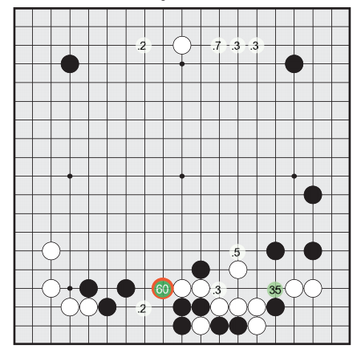
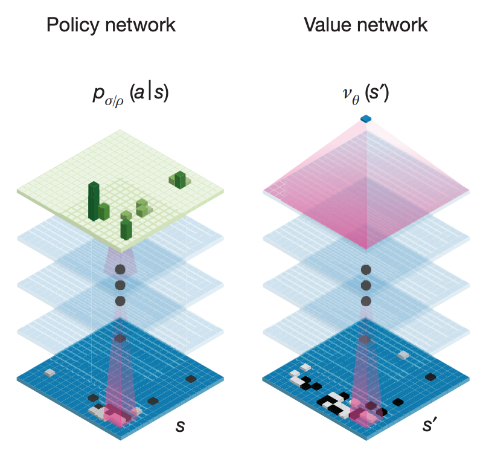
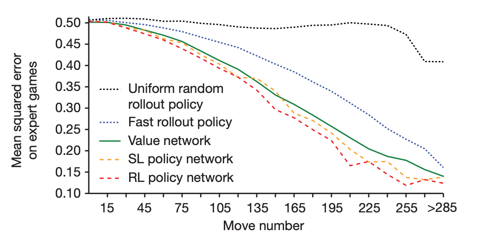
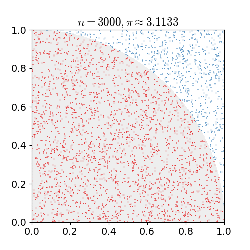
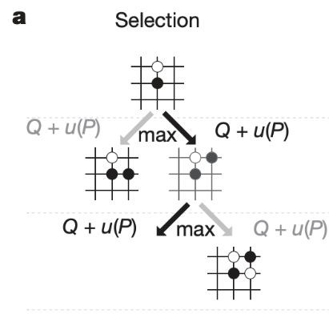
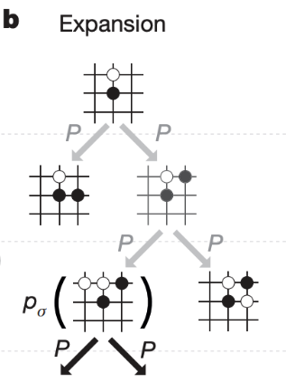
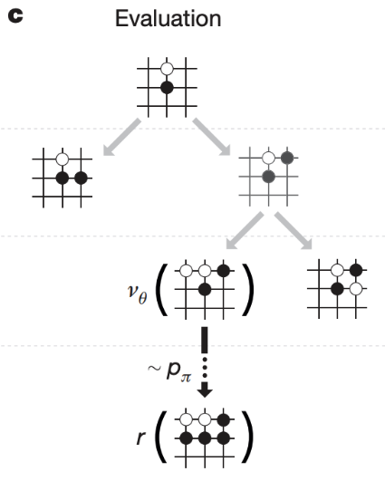
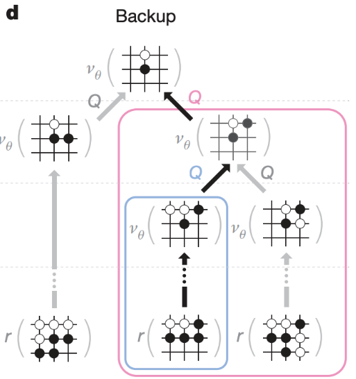

최근 David Silver 교수의 [Reinforcement Learning Course](https://youtu.be/2pWv7GOvuf0) 를 보면서 강화학습에 대해 공부하다 연장선상으로 뒤늦게 AlphaGo 논문을 읽었습니다.
바둑에 대해 전혀 모르더라도 AlphaGo 가 어떻게 동작하는지는 이해할 수 있었습니다.
벌써 2-3년이 지난 논문이지만 간단하게 정리해봤습니다.

<!--truncate-->

# AlphaGo Lee

AlphaGo Lee 는 2016년 3/9 부터 3/15 까지 프로바둑 기사 이세돌과 바둑 게임을 한 딥러닝 모델입니다.
이세돌과 경기를 하기 전에는 유럽 바둑대회를 우승했던 Fan Hui 와 붙어 이겼습니다.
AlphaGo 는 크게 AlphaGo Lee / AlphaGo Zero 버전으로 나뉘는데 여기서는 AlphaGo Lee 만 정리하려 합니다.

바둑은 두 플레이어가 각각 흑백 돌을 두면서 많은 진영을 가진 자가 이기는 게임입니다.
돌을 두기까지 제한된 시간을 쓸 수 있는데 AlphaGo 는 이 시간 동안 트리를 이용하여 경우의 수를 탐색한 후 가장 좋은 수를 둡니다.
이미 컴퓨터로 정복된 체스는 경우의 수가 $$10^{120}$$ 입니다.
하지만 바둑의 경우의 수는 $$10^{170}$$ 으로 모든 경우의 수를 계산하려면 컴퓨터로 수십억 년이 걸린다고 합니다.
AlphaGo 는 이 많은 경우의 수를 어떻게 처리했을까요?

### 가능성이 있는 수들만 탐색해본다.

이기기 위해 굳이 엉뚱한 곳에 수를 두고 경우의 수를 탐색할 필요는 없습니다.
승산이 있어 보이는 곳에 수를 두고 그 이후 경우의 수를 탐색해보면 됩니다.

### 승산이 없는 게임은 굳이 더 탐색하지 않는다.

흔히 우리는 게임을 볼 때 어떤 상황에서 누가 이겼는지 졌는지를 판단하곤 합니다.
게임의 진행 정도가 지나면 지날수록 초보들도 누가 이겼는지 졌는지를 판단할 수 있습니다.
이처럼 이미 승패가 어느 정도 기운 상태에서는 굳이 그 이후의 수까지 탐색할 필요가 없습니다.

그러면 승산이 있을 만한 곳이 어디인지, 바둑판만 보고 내가 승산이 있는지 없는지는 어떻게 파악할까요?

# 필요한 Networks

이전에 언급했던 것과 같이 터무니없는 수를 두지 않기 위해, 바둑판을 보고 승산이 있는지 없는지를 알기 위해서는 몇 개의 준비물이 필요합니다.

1. SL policy network
2. Rollout policy network
3. RL policy network
4. Value network

### SL Policy Network

Supervised Learning Policy Network 는 바둑판의 상태를 입력으로 다음 수가 어디에 놓일지 예측하는 Network 입니다.
다음 수를 어느 곳에 둘지 나타내는 확률 분포가 출력으로 나옵니다.

<small>이미지 출처: Mastering the game of Go with deep neural networks and tree search</small>

전문가들의 기보를 기반으로 트레이닝하여 다음 수를 예측하는 데 대략 57% 의 정확도를 보였다고 합니다.

### Rollout Policy Network

위 SL Policy Network 와 같이 전문가의 기보를 학습시킵니다. 출력도 다음 수에 관한 확률 분포로 위의 Policy Network 와 거의 비슷합니다.
하지만 입력에 대해 CNN을 사용하지 않고 사람이 생각하는 특징들을 입력으로 받으며 상대적으로 SL Policy Network 보다 가볍게 만든 Network 입니다.
정확도는 24% 정도로 SL Policy Network 보다 많이 낮습니다. 하지만 처리 시간은 $$2{\mu}s$$ 로 $$3ms$$ 걸리는 SL Policy Network 보다 1,000배가 넘게 빠릅니다.

### RL Policy Network

Reinforcement Learning Policy Network 로 Network 끼리 플레이를 하면서 Game 을 이기는 방향으로 성장합니다.
Network 구조는 SL Policy Network 와 같습니다. 초기 사이사이 Weight 도 SL Policy Network 와 같은 값으로 초기화합니다.
경쟁 상대는 학습시켜오던 과정 중에 있던 Network 들을 모아 임의로 추출합니다.
예를 들면 SL Policy Network, 500번 학습한 RL Policy Network, 1000번 학습한 RL Policy Network ... 와 같이 Opponent Pool 에 저장한 후 이 Pool 에서 임의로 선택한 Network 와 시합을 하며 성장합니다.
Overfitting 을 막기 위해 많이 학습한 RL Policy Network 끼리 학습시키지 않고 다양한 적들과 상대합니다.
나중에 결과물의 RL Policy Network 는 SL Policy Network 를 상대로 80% 승률을 보였다고 합니다.
정교한 MCTS 를 이용한 프로그램 Pachi 를 상대로는 85% 승률을 보였다고 합니다.
SL Policy Network 는 Pachi 를 상대로 11% 승률을 보였다고 합니다.

### Value Network

Value Network 는 바둑판의 상태를 보고 승률을 예측합니다.
위에서 설명한 Policy Network 들은 바둑판의 상태를 보고 다음 수에 대한 확률 분포를 내뱉습니다.
하지만 Value Network 는 같은 구조로 구성되지만, 승률만 내뱉습니다.

<small>이미지 출처: Mastering the game of Go with deep neural networks and tree search</small>

KGS 데이터로 학습시킨 Value Network 는 일반적으로 승률을 계산하기보다는 그전 결과들을 기억하여 트레이닝 데이터에서는 MSE 가 0.19이었지만 테스트 데이터에서는 0.37이 나왔습니다.
이러한 Overfitting 문제를 피하고자 RL Policy Network 끼리 경기한 3,000만 플레이 데이터를 모았다고 합니다.

<small>이미지 출처: Mastering the game of Go with deep neural networks and tree search</small>

위에 표에서 X 축 오른쪽으로 갈수록 경기가 많이 진행됐음을 의미한다. 경기가 진행되면 될수록 초보자도 승패를 알 수 있으니 대체적으로 error 가 낮아집니다.
하지만 여기서 Policy Network 로 예측한 승률과 Value Network 의 승률 계산이 크게 차이 나지 않음을 볼 수 있습니다.
Policy Network 가 수를 두면서 결괏값을 예측하는 것보다 바둑판의 상태를 보고 승률을 예측하는 Value Network 가 매우 빠르므로 Value Network 를 사용합니다.

# MCTS: Monte Carlo Tree Search

Monte Carlo 는 계산하려는 값을 구하기 힘들 때 수많은 시도를 통해 근사적으로 계산하는 방법을 말한다.
아래 그림은 수많은 점을 찍어 원주율을 계산하는 과정입니다.

<small>이미지 출처: 나무위키</small> -->

MCTS 는 가상으로 수많은 수를 두면서 트리를 구성하는 방식이다. 많은 게임을 하면 할수록 트리는 더 다양한 상황을 탐색하고 더 좋은 수를 알아낼 수 있습니다.
MCTS 는 크게 4 step(Selection, Expansion, Evaluation, Backup) 으로 나눌 수 있습니다.

### Selection, Expansion

MCTS 의 첫 과정 Selection, Expansion 은 SL Policy 를 이용하여 트리를 만들어나갑니다.
트리에는 상태 s 에서 행동 a 를 취했을 때 얼마만큼의 가치가 있는지를 나타내는 $$Q(s, a)$$, 방문 횟수 N(s, a) 그리고 사전확률 P(s, a) 등을 저장합니다.

<small>이미지 출처: Mastering the game of Go with deep neural networks and tree search</small>

먼저 위 그림과 같이 루트에서 $$Q+u(p)$$ 큰 값의 상태를 따라 내려갑니다.

<small>이미지 출처: Mastering the game of Go with deep neural networks and tree search</small>

값이 높은 방향으로 선택하면서 내려가다가 이미 방문했던 상태 이외에 큰 $$Q+u(p)$$ 를 만나면 그림처럼 가지를 뻗어 나갑니다.
$$u(p)$$ 는 $$P(s, a) / N(s, a)$$ 값에 비례합니다.
초기에는 exploration 관점에서 낮은 방문 횟수의 상태를 선호하지만, 점근적으로 $$Q$$가 큰 값을 선택합니다.
방문을 많이 하면 할수록 시뮬레이션을 많이 하고 $$Q$$ 값은 더 정교해집니다.
여기서 RL Policy Network 를 쓰지 않는 이유는 SL Policy Network 가 성능이 더 좋았다고 합니다.

`Humans select a diverse beam of promising moves, whereas RL potimizes for the single best move`

<small>출처: Mastering the game of Go with deep neural networks and tree search</small>

## Evaluation

Selection, Expansion 으로 바둑돌을 놓은 후 얼마나 좋은 수인지 가치를 매깁니다.

<small>이미지 출처: Mastering the game of Go with deep neural networks and tree search</small>

여기서 판단하는 방식이 2가지가 있는데, 첫 번째로는 Value Network 를 써서 바둑판의 상태를 보고 승률을 예측해봅니다.
두 번째로 위에서 언급했던 SL Policy Network 보다 가볍고 빠른 Rollout Policy Network 을 이용해서 가상으로 끝까지 게임을 플레이 합니다.
예를 들면 끝까지 게임을 두어서 내가 흑돌로 플레이 한 상태로 흑돌이 이겼으면 +1 졌으면 -1 보상을 받습니다.
Value Network 의 값과 Rollout Policy Network 로 플레이한 게임의 결과를 합하여 그 수가 얼마나 좋은지 판단합니다.

## Backup

이렇게 Selection, Expansion, Evaluation 을 해서 얻은 값을 지나온 경로의 상태들에 반영됩니다.
반영된 $$Q$$ 값을 보고 다음 Selection, Expansion, Evaluation 을 반복합니다.

<small>이미지 출처: Mastering the game of Go with deep neural networks and tree search</small>

# Conclusion

바둑에서는 셀 수 없이 많은 경우의 수가 존재하지만 AlphaGo 는 탐색할 경우의 수를 줄이면서 프로 바둑 기사에게 승리를 거둡니다.
수 읽기 시간에 많은 시뮬레이션을 통해 가능한 경우의 수들을 트리로 구성합니다.
트리를 구성하는 과정에서 전문가들의 기보를 학습한 Policy Network 로 가능성이 있는 수들만 탐색하고,
Value Network 와 Rollout Policy Network 을 이용하여 승률을 예측합니다.
많은 수를 경험하면 트리의 정확도는 올라가지만 바둑에서는 시간이 제한적이기 때문에 탐색 수를 적절하게 조절해야 합니다.
Atari 게임에서 강화학습을 이용한 사례들과는 다르게 사람의 기보를 기반으로 만든 Network 를 사용한다는 한계가 있습니다.
