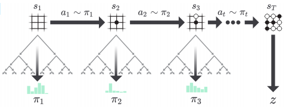
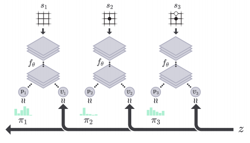
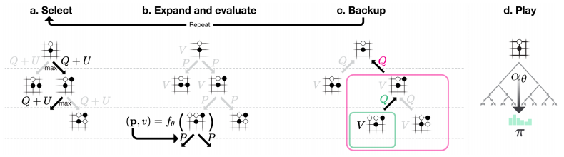
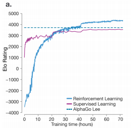
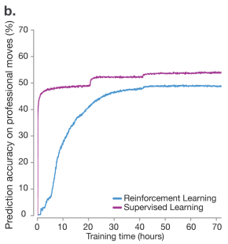

이세돌과의 경기로 AlphaGo Lee 에 대한 존재와 원리는 어느 정도 알고는 있었지만,
다음 버전 AlphaGo Zero 에 대해서는 상대적으로 관심이 적어 찾아볼 생각을 하지 않았었습니다.
AlphaGo Lee 를 공부하게 되면서 AlphaGo Zero 에 대해서도 찾아보고 정리를 하게 되었습니다.

<!--truncate-->

# AlphaGo Zero

AlphaGo Zero 는 2017년 5/32 부터 5/27 까지 프로바둑기사 커제(KeJie) 와 바둑 게임을 한 딥러닝 모델입니다.
AlphaGo Zero 는 커제와의 경기에서 3:0 으로 승리를 거둡니다. 그리고 이전 AlphaGo 모델과의 경기는 100-0 으로 승리합니다.

# AlphaGo Zero vs. AlphaGo Lee

AlphaGo Zero 는 AlphaGo Lee 와 어떤 점이 다를까요?

### 사람의 지식 없이 훈련되었다.

AlphaGo Lee 에서는 전문가의 기보를 SL Policy Network, Rollout Policy Network 가 학습하여 다음 수를 예측했습니다.
하지만 AlphaGo Zero 에서는 사람의 지식 없이 무작위로 수를 두면서 학습합니다.
논문의 이름도 'Mastering the game of Go without Human Knowledge' 입니다.

### 바둑판의 상태만 입력으로 받았다.

AlphaGo Lee 에서는 Rollout Policy Network 가 [일종의 패턴](https://senseis.xmp.net/?Nakade)을 입력으로 받았습니다.
하지만 AlphaGo Zero 에서는 단순히 바둑판의 상태만을 입력으로 받습니다.
현재 흑의 위치, 7수만큼의 흑의 위치, 현재 백의 위치, 7수만큼의 백의 위치 그리고 현재 플레이하고 있는 돌의 색깔까지 해서 총 17가지를 입력으로 받습니다. ($$19*19*17$$)

### 단 하나의 Neural Network 를 사용했다.

AlphaGo Lee 에서 Policy Network, Value Network 를 따로 두었던 것과는 다르게 AlphaGo Zero 에서는 하나로 합칩니다.
단일 Network 는 바둑판의 상태를 입력으로 받아 다음 수의 확률분포와 승률을 같이 출력합니다.

### 학습에 MCTS 를 사용한다.

사람의 지식 없이 어떻게 훈련을 하는지에 대한 핵심입니다.
다양한 시뮬레이션으로 어떤 수가 좋은 지 스스로 배워갑니다.
AlphaGo Lee 에서 수 읽기 시간에 다음 수를 두기 위해서만 MCTS 를 사용했지만, AlphaGo Zero 는 학습에 MCTS 를 활용합니다.

## New Reinforcement Learning Algorithm

전문가들의 기보 없이 어떻게 스스로 성장할까요?

이 알고리즘의 가장 중요한 점은 매 수를 두는 과정에서 매번 MCTS 를 사용한다는 것입니다.
다양한 시뮬레이션을 통해 얻은 수가 랜덤 확률의 수보다 승률이 높은 점을 이용하여 전문가의 기보 없이도 성장할 수 있었던 것입니다.
새로운 Network 의 입력으로는 현재 바둑판의 상태와 7수 정도의 기록을 봅니다. 그리고 수가 놓이는 확률분포와 승률을 출력으로 내뱉습니다.
기존에는 단순히 CNN 을 썼던 것과는 다르게, 많은 Residual block 을 함께 썼습니다.
Residual network 는 Image Recognition 대회에서 좋은 성적을 거둔 Network 의 하나입니다.

{: width="100%" }

<small>이미지 출처: Mastering the game of Go without Human Knowledge</small>

위 그림처럼 매 상태 $$s_t$$마다 가장 최근에 학습시킨 Neural Network 를 이용해서 MCTS 계산을 합니다.
학습되기 전 초기 Neural Network 는 랜덤 위치에 둘 것입니다.
MCTS 계산을 하면 다음 수의 위치가 확률 분포가 나오고 이게 $$\pi_t$$가 됩니다.
여기서 나온 $$\pi_t$$ 에서 가장 큰 값의 $$a_t$$ 를 선택하여 다음 $$s_{t+1}$$ 상태로 넘어갑니다.
이와 같은 과정을 $$s_T$$ 게임이 끝난 상태까지 반복하게 됩니다.
종료 상태에 도달하게 되면 게임에 대한 승패 (+1, -1) 보상 $$z$$ 가 결정됩니다.
이렇게 한 게임이 끝날 때마다 데이터 ($$s_1, \pi_1, z$$), ($$s_2, \pi_2, z$$) ... ($$s_t, \pi_t, z$$) 가 모입니다.

{: width="100%" }

<small>이미지 출처: Mastering the game of Go without Human Knowledge</small>

이 그림은 위에서 얻은 데이터 집합으로 학습하는 그림입니다.
함수 $$f(\theta)$$ 의 입력으로 상태 $$s_1$$ 을 넣으면 결과로 $$p_1$$ 과 $$v_1$$ 이 나옵니다.
여기서 $$p_1$$ 과 $$\pi_1$$ 이 비슷해지도록, $$v_1$$ 과 $$z$$ 의 차이를 줄이는 방향으로 $$\theta$$ 를 업데이트합니다.
또 상태 $$s_2$$ 을 넣어 $$p_2$$, $$v_2$$ 를 구하고 $$\pi_2$$, $$z$$ 와 비슷해지도록 학습합니다.
위와 같은 과정을 반복하여 $$f(\theta)$$ 가 상태 $$s$$ 를 입력으로 받아 다음 수에 대한 확률분포, 승률을 예측하는 Neural Network 로 완성됩니다.

여기서 오차함수는 아래와 같이 정의합니다.

$$l = (z-v)^2 - \pi^T log(p) + c ||\theta||^2$$

# MCTS: Monte Carlo Tree Search

{: width="100%" }

<small>이미지 출처: Mastering the game of Go without Human Knowledge</small>

### Select

AlphaGoLee 에서와 같이 트리에서 $$Q+U$$ 값이 큰 방향으로 선택하며 내려갑니다.
상태 s 에서 행동 a 를 취했을 때 얼마만큼의 가치가 있는지를 나타내는 게 $$Q(s, a)$$ 입니다.
$$U$$ 는 방문 횟수 N(s, a) 와 사전확률 P(s, a) 에 따라 값이 달라집니다.

### Expand and Evaluate

$$Q+U$$ 값을 따라 내려간 후 둔 수에서 $$f(\theta)$$ 를 이용해 수를 둡니다. 그리고 그 수에 대한 평가 과정을 거칩니다.

### Backup

평가한 후 따라갔던 트리 노드들의 값들도 갱신해줍니다.

### Play

트리를 만들고 나면 어느 정도 시뮬레이션을 거친 다음 수에 대한 확률분포를 얻게 되는데 이 값을 $$\pi$$ 라고 합니다.

# Resources and Performance

AlphaGo Zero 는 전문가의 수를 배우지 않고 스스로 랜덤한 수부터 시작하여 나중에는 월등한 실력을 보여줍니다.

<small>이미지 출처: Mastering the game of Go without Human Knowledge</small>

그것도 단 3일 만에 AlphaGo Lee 를 뛰어넘습니다. 참고로 [Elo Rating](https://ko.wikipedia.org/wiki/%EC%97%98%EB%A1%9C_%ED%8F%89%EC%A0%90_%EC%8B%9C%EC%8A%A4%ED%85%9C)
은 평점 산출법의 하나입니다.
매번 MCTS 를 수행하는 AlphaGo Zero 에서 얼마만큼의 MCTS 를 하느냐도 중요합니다.
너무 많이 MCTS 를 수행하면 시간이 오래 걸리고 또 적게 한다면 학습 속도가 느려질 수 있기 때문입니다.
AlphaGo Zero 는 매번 1600 의 MCTS 과정을 거쳤다고 합니다. 또한 490만 self-play 를 했다고 합니다.

<small>이미지 출처: Mastering the game of Go without Human Knowledge</small>

또 재밌는 점은 전문가 수 예측 확률이 기존에 전문가 수를 배운 Network 보다 더 낮습니다.
실제로 바둑 기사들이 두는 수가 최적이 아닐 수도 있겠네요.

# Conclusion

AlphaGo Zero 는 AlphaGo Lee 와 가장 크게 다른 점은 사람의 지식 없이 학습했다는 것입니다.
스스로 매 게임 매 수마다 다양하게 수를 경험하며 쌓은 MCTS 로 성장합니다.
단일 Network 로 학습 속도도 빠르며 실력도 월등히 좋아졌습니다.
