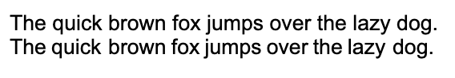
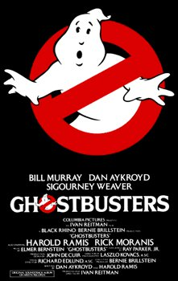
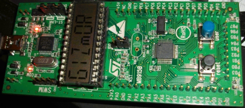
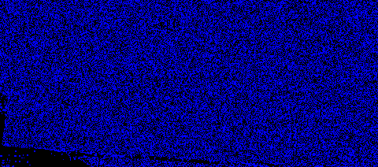
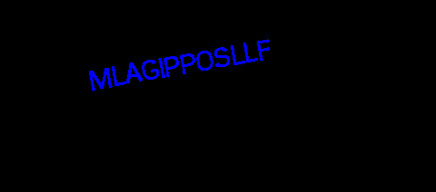
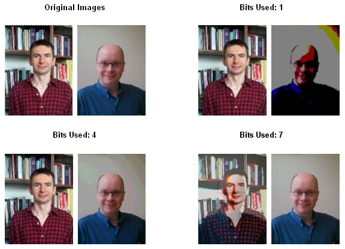
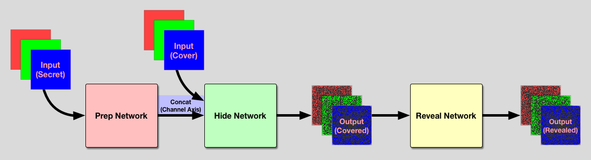
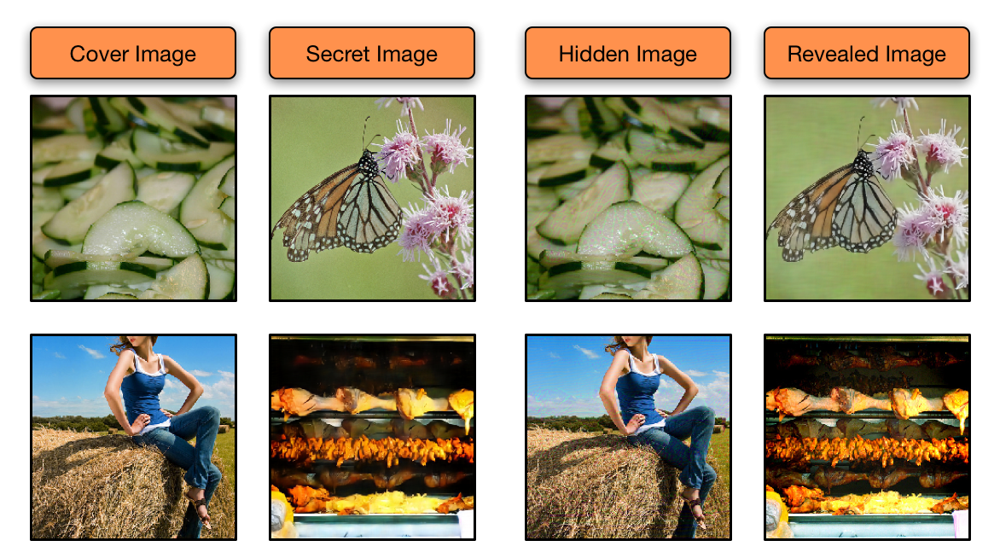
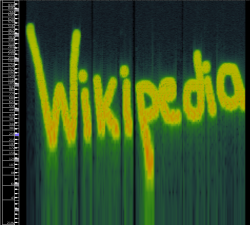

2020 년 새해를 맞아 [사내 개발팀 워크샵](http://engineering.vcnc.co.kr/2019/01/vcnc-workshop-for-developers/) 라이트닝 톡 발표를 위해 준비한 소재 Steganography 정리해봤습니다.

<!--truncate-->

# What is Steganography?

Steganography 는 메시지를 숨길 때 사용하는 기술로 다른 집단 혹은 개인에게 들키지 않고 메시지를 전달하는 게 목적입니다. 현대에서는 Watermarking 이나 FingerPrint 분야에서도 쓰입니다.

## Steganography vs. Encryption

Encryption 은 모든 사람이 메세지를 볼 수 있습니다. 하지만 정보를 얻으려면 암호화된 메세지를 풀 수 있는 열쇠가 필요하죠. 그래서 Encryption 은 풀기보다 못 읽게 하거나 없애는 게 더 쉽습니다.
Steganography 는 메시지 존재 자체를 숨기는 기술입니다. 전달하는 사람과 받는 사람 이외에 사람들은 비밀리에 메시지를 주고 받는 것도 모를 수 있습니다.

## History

Steganography 의 역사는 기원전 440년부터 시작합니다. 고대 그리스에서는 나무에 메시지를 적고 왁스로 덮는 방식을 이용했다고 합니다.
히스타이오스(Histiaeus)는 그리스에게 페르시안 공격을 전하기 위해 친애하는 노예의 머리를 밀고 메시지를 타투로 새겼습니다. 머리가 자라면서 메시지는 숨겨졌습니다.


출처: [hareenlaks's blog](https://hareenlaks.blogspot.com/2011/04/history-of-steganography.html)

세계 2차 대전에는 프랑스 저항군이 보이지 않는 잉크를 이용하여 메시지를 전달했습니다. 또한 간첩들은 microdots 을 이용해서 비밀 메시지를 담은 이미지를 생성하고 사용했습니다.
microdots 을 종이에 적고 collodion 용액으로 덮었습니다. 메시지는 빛을 비추면 보였습니다.
인형 딜러로 위장한 스파이는 얼마나 많은 인형을 배에 실을지에 대한 주문서에 메시지를 숨겨 배의 움직임을 알렸습니다.


출처: [hareenlaks's blog](https://hareenlaks.blogspot.com/2011/04/history-of-steganography.html)

또한 911 테러에도 오사마 빈라덴이 테러에 스테가노그래피를 이용했다고 합니다. [포르노 사진, 스포츠 채팅 창에서의 글들을 이용하여 미국 테러에 대한 지령을 전달했다고 합니다.](https://usatoday30.usatoday.com/life/cyber/tech/2001-02-05-binladen.htm)

# Techniques for Steganography

위의 역사에서 보듯이 메시지를 숨기는 방법은 다양합니다. 간단하게 사용되고 있는 여러 기술들을 소개하겠습니다.

## Binary File Techniques

CopyRight 를 프로그램 내에 새기는 방법 중 하나입니다.

```
a = 1
b = 3
c = b + 3
d = b + c
```

위와 같은 코드에서 `a = 1` 의 위치는 중요하지 않습니다. `a = 1` 의 위치를 통해서 0 과 1 을 표현할 수 있습니다.
이 방법을 이용하기 위해 먼저 전체 코드를 n 개의 블락으로 나눕니다. 이렇게 나눈 n 개의 블락에서 `a = 1` 와 같은 코드의 위치를 변경하거나 그대로 둠으로써 숨기려는 메시지를 n 자리 이진수로 표현합니다.

[$$w_1$$, $$w_1$$, ..., $$w_n$$] ($$w = 0$$ or $$w = 1$$)

이렇게 작업한 파일과 원본 파일을 비교해서 삽입된 메시지를 추출할 수 있습니다.

## Text Techniques

### Whitespace Manipulation

여백을 이용하는 여러 방법이 있습니다. 그 중 하나로 Line Shift 가 있습니다. 문서의 라인을 미세하게 올리거나 내려서 0 과 1 을 표현합니다. 약 1/300 인치를 이동시키기 때문에 사람의 눈으로는 파악하기가 힘듭니다. 또 Line Shift 와 비슷하게 Word Shift 가 있습니다. 단어를 아래 그림과 같이 왼쪽 오른쪽으로 미세하게 이동시켜 0 과 1을 표현할 수 있습니다.



또한 글 단락 사이라던지 문장의 끝에 특정 양의 빈 여백을 넣어 메시지를 표현할 수도 있습니다.

### Feature Coding

다양한 특성들을 이용하는 방법입니다. 예를 들면 특정 글자의 높이라던지 i 와 j 의 점을 이용하거나 f 와 t 처럼 수평적인 획의 길이를 이용하기도 합니다.

### XML

<!--  -->

위와 같이 데이터에 영향을 주지 않는 일정한 규칙을 통해 메시지를 나타낼 수 있습니다.

## Image Techniques

이미지를 이용한 간단한 방법을 소개합니다. 해킹 챌린지 사이트 [Wechall](http://www.wechall.net/challenge/training/) 에서도 이미지와 관련된 steganography 문제를 다루고 있습니다.
해당 사이트에서 stegano1 디렉토리에 들어가면 아래와 같은 이미지를 볼 수 있습니다. 실제 크기는 굉장히 작습니다.


이 파일을 읽으면 `BMf6(0Look what the hex-edit revealed: passwd:steganoI` 와 같은 메시지를 볼 수 있습니다. 이와 같이 단순한 이미지를 통해 메시지를 담는 방법을 알아보겠습니다.

### Insertion

파일마다 끝을 나타내는 EOF 바이트가 존재합니다. JPEG의 경우에는 `FF D9` 바이트로 끝나고 PNG 의 경우에는 `89 50 4E 47 0D 0A 1A 0A` 값으로 시작합니다. 파일이 끝났음을 나타내는 바이트 뒤 데이터는 무시합니다. 이 원리를 이용하여 파일이 끝났음을 나타내는 바이트 뒤로 데이터를 숨길 수 있습니다. 끝에 숨기는 것과 비슷하게 헤더에도 데이터를 숨길 수 있습니다. 파일 헤더 중 이미지에 영향을 주지 않는 부분에 데이터를 숨길 수 있습니다.
[Wechall](http://www.wechall.net/challenge/training/stegano/attachment/) 에 들어가면 아래와 같은 이미지를 다운 받을 수 있습니다.



단순히 이미지만 보면 예전에 인기를 끌었던 표지입니다.
<!--  -->

```
(생략)
0x4a 0x3 0xff 0xd9 0x50 0x4b 0x3 0x4 0xa 0x0 0x0 0x0 0x0 0x0
0x43 0x46 0x3a 0x50 0x26 0xbd 0xd2 0xfd 0xc 0x0 0x0 0x0 0xc 0x0
0x0 0x0 0xc 0x0 0x0 0x0 0x73 0x6f 0x6c 0x75 0x74 0x69 0x6f 0x6e
0x2e 0x74 0x78 0x74 0x43 0x42 0x4e 0x53 0x50 0x45 0x42 0x41 0x45
0x47 0x48 0x41 0x50 0x4b 0x1 0x2 0x3f 0x3 0xa 0x0 0x0 0x0 0x0 0x0
0x43 0x46 0x3a 0x50 0x26 0xbd 0xd2 0xfd 0xc 0x0 0x0 0x0 0xc 0x0 0x0
0x0 0xc 0x0 0x0 0x0 0x0 0x0 0x0 0x0 0x0 0x0 0x0 0x0 0xb6 0x81 0x0
0x0 0x0 0x0 0x73 0x6f 0x6c 0x75 0x74 0x69 0x6f 0x6e 0x2e 0x74 0x78
0x74 0x50 0x4b 0x5 0x6 0x0 0x0 0x0 0x0 0x1 0x0 0x1 0x0 0x3a 0x0
0x0 0x0 0x36 0x0 0x0 0x0 0x0 0x0
```

여기서 자세히 보면 JPEG Footer Signature 인 `0xff 0xd9` 값을 찾을 수 있습니다. 파일이 끝났다는 signature 이후에도 많은 데이터가 있는 것으로 보아 이 부분만을 추출해봅니다.
이후에 바로 이어지는 `0x50 0x4B 0x3 0x4` 는 ZIP Header Signature 이기도 합니다.

<!--  -->

파이썬을 이용하여 JPEG 이후 데이터를 ZIP 파일로 저장합니다. 이후 압축을 풀면 'solution.txt' text file 을 얻을 수 있습니다.
`solution.text` 에는 `CBNSPEBAEGHA` 와 같은 코드명이 담겨있네요.

### LSB

다음으로 알아 볼 방법은 LSB (Least Significant Bit) 입니다. 24 비트 이미지 파일은 RGB 를 각 8비트씩 이용하여 색을 표현합니다.
여기서 1비트만 수정하여 메시지를 숨길 수 있습니다. 1비트만 수정하기 때문에 사람 눈으로는 알아채기 쉽지 않습니다.

[Wechall](http://www.wechall.net/challenge/training/stegano/LSB/) 에서도 LSB 에 대한 문제를 찾을 수 있습니다.



위 그림만 보면 전자제품의 부품 같네요. 이 이미지를 OpenCV 를 이용하여 풀어보겠습니다.

<!--  -->

해당 이미지를 읽어 RGB 에 해당하는 LSB 와 AND 연산을 하는 코드입니다.

BLUE 0 번 비트와 AND 연산한 결과


BLUE 1 번 비트와 AND 연산한 결과


위와 같이 메세지가 숨겨져 있는 것을 볼 수 있습니다.
이 방법은 비트가 올라가면 올라갈수록 원 이미지를 훼손하게 됩니다.



출처: [Steganography And Digital WaterMarking](https://www.cs.bham.ac.uk/~mdr/teaching/modules03/security/students/SS5/Steganography.htm)

### Deep Learning

마지막으로 알아볼 기술은 Deep Learning 을 이용한 기술입니다. 아래 그림과 같은 네트워크를 이용하여 이미지를 만들어냅니다.



출처: [Hiding Images using AI — Deep Steganography](https://buzzrobot.com/hiding-images-using-ai-deep-steganography-b7726bd58b06)

숨기려는 이미지 (Secret Image) 와 포장하려는 이미지 (Cover Image) 를 Input 으로 Covered Output 을 만듭니다. 그리고 이를 해석할 Reveal Network 를 통해 다시 Secret 이미지를 추출합니다.
여기서에 오차는 (Input 으로 사용한 Cover 이미지 - 비밀이미지를 담은 결과물) + (Input 으로 사용한 Secret 이미지 - Reveal Network 으로 뽑아낸 Secret 이미지) 로 합니다.



출처: [Hiding Images using AI — Deep Steganography](https://buzzrobot.com/hiding-images-using-ai-deep-steganography-b7726bd58b06)

위 사진은 이전에 설명한 네트워크의 결과물입니다. 더 자세한 내용은 해당 블로그 [Hiding Images using AI](https://buzzrobot.com/hiding-images-using-ai-deep-steganography-b7726bd58b06) 참고하시면 됩니다.

## Sound Techniques

### Spectogram

Spectogram 은 소리나 파동을 시각화하는 방법입니다. 시간축, 주파수 축 변화에 따라 진폭의 차이를 색상의 차이로 나타냅니다. 이와 같이 소리에도 메시지를 숨길 수 있습니다.



[The Apex Face](http://www.bastwood.com/?page_id=10) 의 글을 보시면 재밌는 이미지를 볼 수 있습니다.

### Echo Hiding

에코를 이용하여 데이터를 숨기는 방법도 있습니다. 진폭, Decay 비율, Offset 을 사람들이 알아채지 못할 정도로 설정하여 메시지를 전달합니다.

# Conclusion

메시지를 숨기는 간단한 방법들을 알아봤습니다. Sound Technique 에는 1940년 대 군에서 많이 쓰인 Spread Spectrum, Parity Bit 개념을 이용한 Parity Coding, 사람들이 파악하기 힘든 Phase 변조를 통한 Phase Coding 등이 있습니다.
또한 이미지와 소리 기술은 비디오에서도 적용할 수 있습니다. 현대에서는 Watermarking 문제를 위해 이러한 기술들이 발전되고 있으니 다른 기술들도 찾아보시면 재밌겠네요.

# Reference

- [Steganography 의 역사](http://hareenlaks.blogspot.com/2011/04/history-of-steganography.html#more)
- [Wechall 문제 해석](https://bpsecblog.wordpress.com/2016/08/21/amalmot_4/)
- [Steganography And Digital Watermarking](https://www.cs.bham.ac.uk/~mdr/teaching/modules03/security/students/SS5/Steganography.htm)
- [Hiding Images using AI](https://buzzrobot.com/hiding-images-using-ai-deep-steganography-b7726bd58b06)
