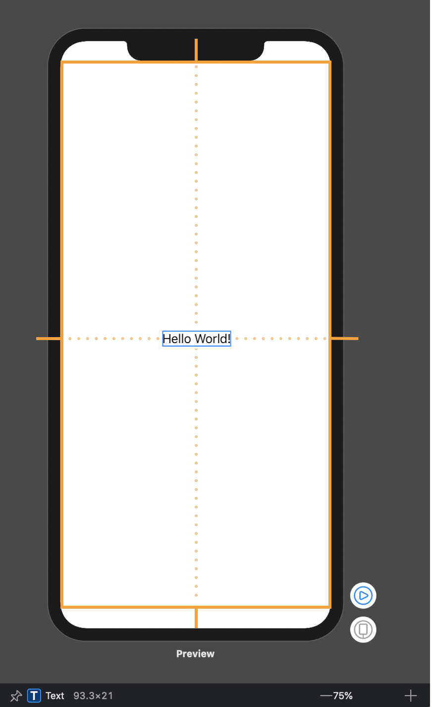
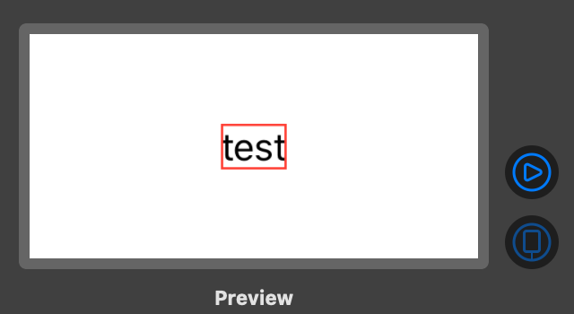
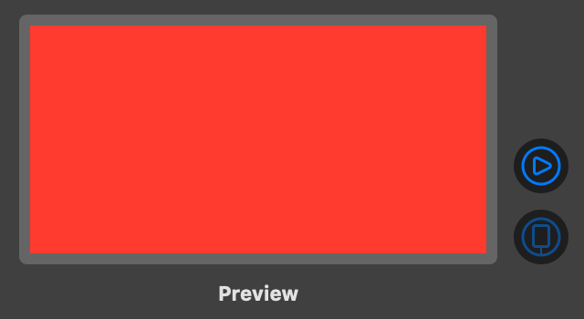
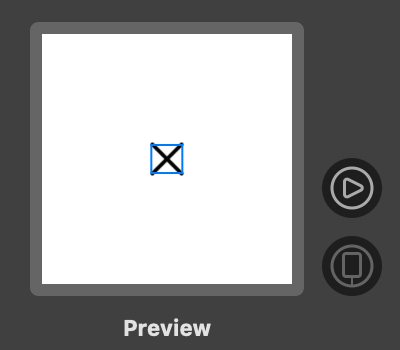
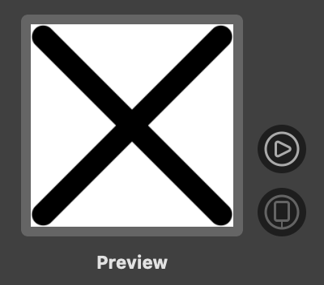
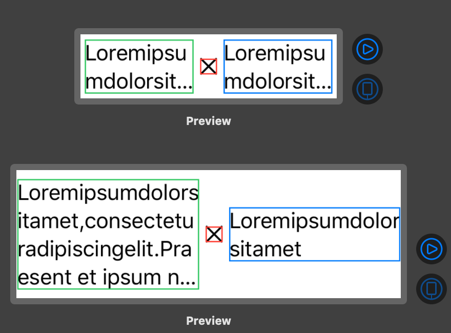
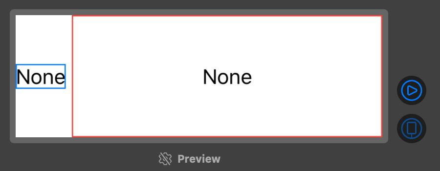
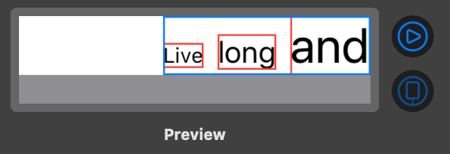
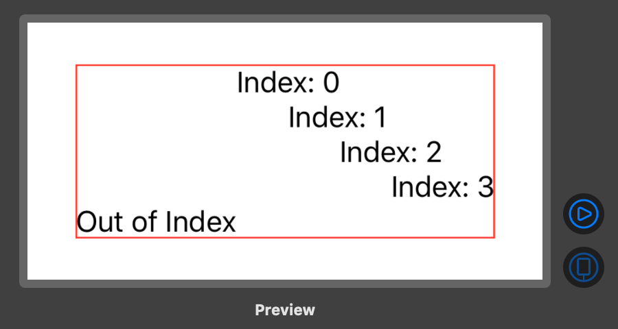

최근에 SwiftUI 를 이용해 앱을 만들어 보면서 알게 된 사실들을 정리해보려 합니다. 이번 글은 View 사이즈를 계산하고 배치하는 방법과 과정에 대해 정리해봤습니다.

<!--truncate-->

# Layout Process

1. 먼저 부모 View 는 자식 View 에게 가능한 영역의 크기를 알려줍니다. 가장 최상위 View 에서는 safe area 를 제외한 스크린 크기가 되겠네요.
   
   출처: [hareenlaks's blog](https://kean.github.io/post/swiftui-layout-system)

2. 부모 View 가 알려준 영역을 기반으로 자식 View 는 자신의 크기를 계산합니다.
3. 자식 View 는 자신의 크기를 부모 View 에게 알려주고 부모는 자식 View 를 자신의 영역에서 배치합니다.
   <!--  -->

과정 2번에서 자식 View 들은 크기를 어떻게 정할까요?

# Size Calculation

## Fit vs. Fill

View 가 크기를 계산하는 방식은 두 가지로 나눌 수 있습니다. 컨텐츠를 기반으로 계산하는 Fit 과 부모로 부터 전달받은 영역을 채우는 Fill 이 있습니다.
컨텐츠를 기반으로 계산하는 Fit 방식으로는 Text, Stack 등이 있고 가능한 영역을 채우는 Fill 방식으로는 GeometryReader, Spacer 등이 있습니다.

<!--  -->

Text 는 Parent 에게 전달받은 영역이 아무리 커도 컨텐츠 만큼 크기를 차지하는 반면에 Color 는 부모가 제시한 크기만큼 크기를 차지합니다.

Image 는 `resizable` modifier 에 따라 동작이 다릅니다. `resizable` 을 사용하지 않은 Image 는 컨텐츠 크기 만큼 영역을 차지합니다.
큰 이미지의 경우 스크린 영역을 벗어날 수 있습니다.
하지만 `resizable` modifier 가 붙으면 가능한 영역 안에서 컨텐츠를 보여 줍니다.

<!--  -->

## Layout Process in Stack

SwiftUI 에서는 여러 View 들을 한 화면에 보여주기 위해 Stack 을 사용합니다.
HSack, VStack 내에 View 들은 크기를 계산하는 과정에서 서로 영향을 줍니다. Stack 내에서 추가로 거치는 레이아웃 과정은 아래와 같습니다.

1. 먼저 부모 View 가 제시한 영역에서 자식 View 간 spacing 을 제외합니다.
2. spacing 을 제외한 영역을 동등하게 나눕니다. 그리고 고정할 수 있는 자식부터 크기를 정합니다.
   고정할 수 있는 자식 View 의 크기를 정한 후 1번에서 계산한 영역에서 제외합니다.
   이후 크기를 정한 자식들을 영역에서 제외하면서 나머지 자식 View 들의 크기도 정합니다.
   - 예를 들어 `HStack { Text, Image, Text }` 와 같은 경우 Image 는 이미지 크기가 정해져 있으니 크기를 고정할 수 있습니다.
     이후 우선순위가 높은 Text View 크기를 먼저 정하고 차례대로 반복합니다. 위 예에서는 우선순위가 같으니 같은 크기를 가집니다.
3. 모든 자식 View 의 크기가 정해지면 배치 옵션에 따라 배치합니다.
   <!--  -->

컨텐츠 양은 다르지만 정해진 영역에서 같은 크기를 같는 Text

Stack 내에 Fill 타입의 View 가 존재하면 Stack 의 크기도 Parent 를 가득 채우게 크기가 결정됩니다.

<!--  -->

# Alignments

화면에 배치할 View 들의 크기가 어떻게 정해지는지 알았다면 어떻게 배치하는지 알아야 합니다.
가장 기본적인 배치로는 Stack Initializer 에서 alignment 파라미터
혹은 `frame(width: CGFloat, height: CGFloat, alignment: Alignment)` 에서 어떻게 배치할지를 설정할 수 있습니다.

<!--  -->

그 외에 custom 하게 배치하고 싶을 때 쓰는 modifier 가 있습니다.
`alignmentGuide()` 는 바꾸고 싶은 alignment guide 와 새로운 alignment 를 정하는 closure 를 필요로 합니다.
closure 내에서 view 의 width, height, edge 정보를 가진 `ViewDimension` 객체에 접근하여 새롭게 배치할 수 있습니다.

<!--  -->

# Conclusion

이번 글에서는 SwiftUI 에서 View 크기를 어떻게 계산하고 배치하는 지에 대해 정리해봤습니다.
AutoLayout 을 사용할 때에는 부모 View 와 자식 View Constraint 가 양방향으로 동작하기 때문에
Constraint 를 변경하거나 추가할 때 충돌이나 Ambiguous 경고가 뜨는 경우가 많았습니다.
Xib 와 View 코드 사이를 이동해서 커서로 Constraint 를 추가해야하는 부분도 번거로웠습니다.
또한 코드에서 각 View 의 depth 를 파악하기 힘들었습니다.
그에 비해 SwiftUI 에서 Layout 에 대한 어떤 정보를 입력하지 않아도 에러나 경고가 뜨지 않습니다.
또한 View 의 Depth 파악도 Indent 로 구분되어 알아보기 편했습니다.
Stack 이나 GeometryReader 를 통해 위치를 조정하다 보니 View 를 선언하는 Indent Depth 가 깊어지긴 하나
View 를 Component 로 잘 묶어내면 이러한 부분은 해결할 수 있다고 생각합니다.

# Reference

- [SwiftUI Layout System](https://kean.github.io/post/swiftui-layout-system)
- [How layout works in SwiftUI](https://www.hackingwithswift.com/books/ios-swiftui/how-layout-works-in-swiftui)
- [Intro to SwiftUI](https://medium.com/@suyash.srijan/intro-to-swiftui-part-2-6b7e792c21ef)
- [Fitting and Filling views in SwiftUI](https://swiftwithmajid.com/2020/05/20/fitting-and-filling-view-in-swiftui/)
