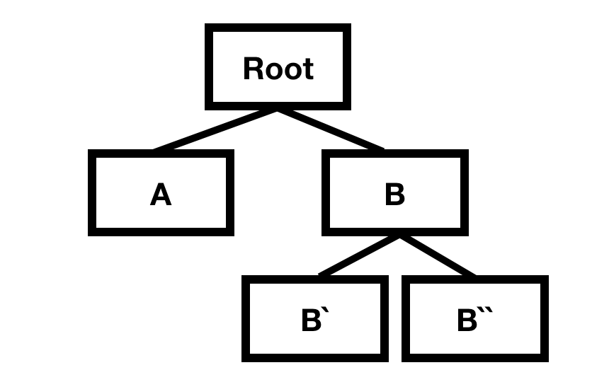

SwiftUI 에서 View 는 SwiftUI 가 무엇을 어떻게 그릴 것인지 에 대해 명시한 가상의 객체입니다.
다양한 데이터를 보여주기 위해 SwiftUI 에서는 여러 Component 를 만들고 Component 들 간의 데이터 전달하는 과정이 필요합니다.
이번 글에서는 SwiftUI 에서 Parent 와 Child 간 데이터를 전달하는 방법들을 정리해봤습니다.

<!--truncate-->

# From Parent to Child

## Initializer

Parent 의 값을 전달받는 가장 기본적인 방법으로는 Child View 의 Initializer 로 전달하는 방법이 있습니다.
SwiftUI 에서 `@State` 를 선언한 property 의 값이 바뀔 때마다 var body: some View 에 선언된 자식 View 들을 새로 그립니다.
State 가 바뀔 때 마다 자식 View 들을 매번 새로 생성해서 갱신된 데이터를 보여줄 수 있습니다.

<!--  -->

## Environment

`@Environment` property wrapper 는 모든 View 에서 접근할 수 있는 데이터 입니다.
그래서 보통 Dark / Light 모드 인지, Core Data Managed Object Context 와 같은 요소들에 적합합니다.
`@Environment` 로 접근할 수 있는 목록은 [링크](https://developer.apple.com/documentation/swiftui/environmentvalues)를 보면 됩니다.

`.environment()` 를 통해서 특정 자식 View Tree 에는 다른 환경을 적용할 수 있습니다.
예를 들면 자식 A, 자식 B 이 있을 때 자식 A 에 `.environment(\.colorScheme, .light)` 와 같이 선언하면 자식 A 의 Subtree 는 모두 light 적용됩니다.
기존에 존재하는 값들 외에도 `EnvironmentKey` 와 `EnvironmentValues` 를 이용하여 custom 값을 저장할 수도 있습니다.
<!--  -->

`@EnvironmentObject` 를 이용하면 `ObservableObject` 을 추가하여 Scope 를 만들 수도 있습니다.
<!--  -->

위 예제와 같이 `ObservableObject` 를 주입하여 주입한 Scope 아래 View 들은 해당 객체에 접근이 가능합니다.

# From Child to Parent

## Initializer - Callback

부모 Component 가 자식 Component 에게 Callback 을 전달하여 데이터에 접근하는 방법이 있습니다.

<!--  -->

## Binding

`@Binding` property wrapper 를 이용하여 부모에게 데이터를 전달하는 방법이 있습니다.
부모의 `@State` property 와 `@Binding` 을 이용하여 자식 View 를 다시 그려 갱신된 데이터를 보여주는 방법입니다.
<!--  -->

위와 같은 예제는 변경된 데이터를 바로 보여주고 싶지 않은 경우엔 적절하지 않을 수 있습니다.
확인 버튼을 눌렀을 때 View 를 새로 그리고 싶은 경우 `@State` 를 사용하지 않고 Class 를 이용하는 방법도 있습니다.
아래 코드와 같이 score 값에 따라 View 를 갱신하는 로직을 Class 안에 숨길 수 있습니다.
store 내에 score 값은 갱신했지만 View 를 새로 그리는 로직은 Store 내에서 정할 수 있습니다.

<!--  -->

## Preference

자식이 부모에게 데이터를 전해주는 방법으로 Preference 를 이용하는 방법이 있습니다.
자식 View 는 Preference 값을 등록하고 부모는 `onPreferenceChange` 를 통하여 자식 View 들의 Preference 값 변화를 감지할 수 있습니다.
같은 Prefenece Key 값을 사용하는 모든 자식들의 Preference 값에 차례대로 접근합니다.

<!--  -->
위의 예제 코드에서 첫 번째 Preference 는 모든 자식을 만날 때마다 값을 갱신하기 때문에 제일 마지막 자식 Preference 가 저장됩니다.
그래서 첫째 자식 View 의 Preference 가 변경되었다 하더라도 마지막 View 의 Preference 가 변경되지 않았다면 부모의 `onPreferenceChange` 가 불리지 않습니다.
모든 자식의 Preference 를 모아 어떤 값을 쓸 지 정하고 싶다면 예제 코드에서 아래 Preference Key 처럼 리스트를 이용하면 모든 자식의 Preference 변화를 감지할 수 있습니다.

`onPreferenceChange` 를 통해 같은 Preference 를 감지하고 있어도 자식이 아닌 경우에는 호출되지 않습니다.

위의 그림을 예로 들면 B 의 자식 B\`, B\`\` 의 Preference 가 변경되면 A 에 같은 Preference Key 로 `onPreferenceChange` 를 등록해놨다 하더라도 불리지 않습니다.

# Conclusion

이번 글에서는 Component 간 데이터를 전달하는 방법에 대해서 정리해봤습니다.
Callback 을 전달하는 것과 Binding 을 이용하는 것은 부모의 자식의 사이가 먼 경우
모든 Component 에서 Parameter 로 전달해야 하기 때문에 Preference Key 를 활용하는 게 편리합니다.
Initializer, Callback, Binding, Preference 와 같이
부모와 자식 View 간에 데이터를 주고 받는 방법이 다양하기 때문에 적절하게 사용하는 게 중요합니다.

## Reference

- [Communicating with the view tree part 1](https://swiftui-lab.com/communicating-with-the-view-tree-part-1/)
- [Communicating with the view tree part 2](https://swiftui-lab.com/communicating-with-the-view-tree-part-2/)
- [The power of environment in SwiftUI](https://swiftwithmajid.com/2019/08/21/the-power-of-environment-in-swiftui/)
- [Understanding SwiftUI State](https://medium.com/flawless-app-stories/swiftui-understanding-state-8afa23fd9f1f)
- [The power of Environment in SwiftUI](https://swiftwithmajid.com/2019/08/21/the-power-of-environment-in-swiftui/)
