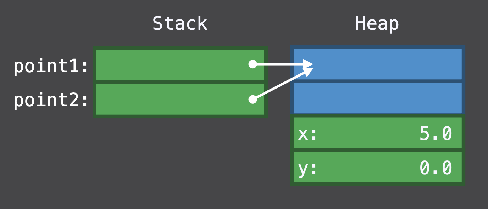
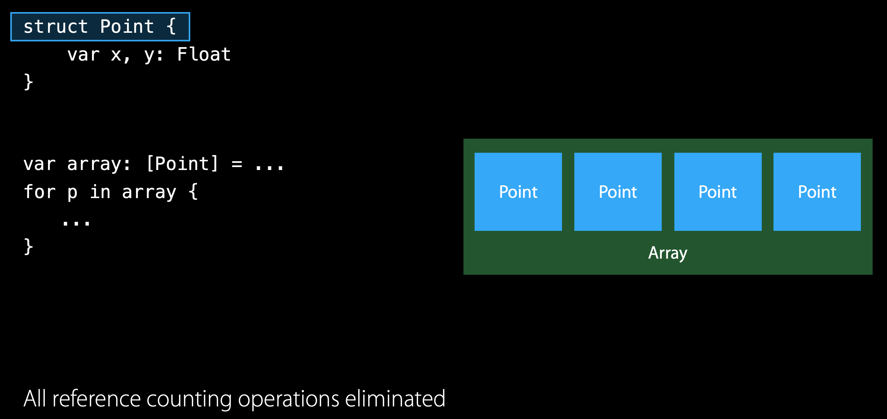
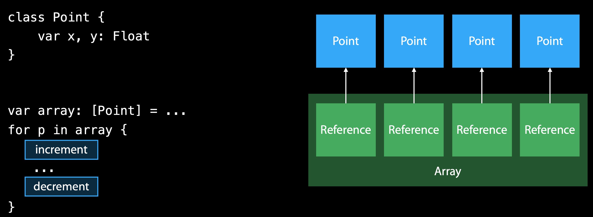
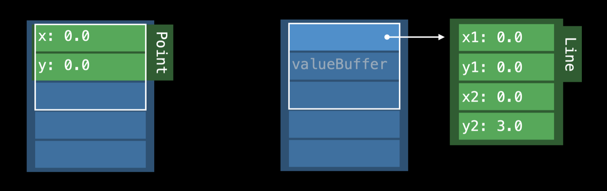

영어 읽는 습관을 기르고 기술적인 내용을 많이 접하기 위해 [Medium](https://medium.com/) 글들을 많이 읽으려고 노력합니다.
많은 글들을 접하던 중 [Can You Answer This SImple Swift Question Correctly?](https://medium.com/swlh/can-you-answer-this-simple-swift-question-correctly-3d2836cff7b1) 글을 읽었는데
Closure 안에서 변수 접근에 대한 질문에 많은 사람들이 제대로 답을 하지 못했다 라고 합니다.
평소에 중요하게 생각했던 부분이었고 면접 준비를 위해 정리하기로 했습니다.

<!--truncate-->

# Questions

아래 질문들에 답변을 할 수 있다면 내용은 읽을 필요 없습니다 :)
<!--  -->

ARC 는 Automatic Reference Counting 의 약자로 자동으로 Reference Count 를 자동으로 관리해주는 방식입니다.
Reference Counting 방식은 Reference 의 갯수를 보고 해당 객체가 필요한지 여부를 판단합니다.
Reference 의 갯수가 0 이면 해당 객체는 필요없다고 판단하여 메모리 해제시키는 방식입니다.
JVM 에서 작동하는 Garbage Collection 은 프로그램 실행 중에 더 이상 필요 없는 객체들을 주기적으로 찾아 메모리 해제시켜 버립니다.
이와 다르게 ARC 는 컴파일 시점에 구문을 분석하여 적절하게 Reference Counting 코드를 삽입하여 메모리 할당, 해제를 합니다.
원래 iOS 4 전에는 Objective-C 코드로 `alloc`, `new`, `retain` `release` 등 직접 코드로 작성하여 메모리 할당, 해제 했습니다.

## How Reference Counting Works

<!--  -->

출처: [WWDC 2016 Understanding Swift Performance](https://developer.apple.com/videos/play/wwdc2016/416/)

위 그림에서와 같이 point2 변수가 같은 객체를 가리키면서 reference count 는 2 가 됩니다.
모든 동작이 끝나고 Reference 가 없어지면서 Point 객체는 메모리에서 해제됩니다.

## Strong, Weak, Unowned

객체에 대한 모든 Reference 가 Reference Counting 에 영향을 주는 것은 아닙니다.
Weak, Unowned 는 객체의 Reference Count 를 증가시키지 않기 때문에 메모리에서 해제될 수도 있습니다.

Strong Reference 는 위에서 설명한 특성으로 인해 잘못 사용하면 Memory leak 이 발생할 수 있습니다.
필요 없어진 객체가 Reference Count 가 0 이 되지 않아 메모리를 차지하게 되는 상황이죠.
시간이 지나 서비스를 사용할 수록 메모리가 증가하면서 이상하게 동작할 수가 있습니다.

<!--  -->
위 코드의 경우 ObjectA 가 ObjectB 에 대한 reference 를 없애도 ObjectB, ObjectC 서로 가리키고 있습니다.
시간이 지남에 따라 이러한 객체들이 엄청난 메모리를 잡아먹으면서 서비스가 먹통이 될 수 있습니다.

Weak, Unowned Reference 는 Strong Reference 와 달리 Reference Count 를 증가시키지 않습니다.
Weak Reference 는 해당 객체를 Optional 하게 참조합니다. 반면에 Unowned Reference 는 해당 객체가 절대 nil 이 될 수 없다는 가정의 reference 입니다.
Unowned Reference 로 참조한 객체가 메모리 해제됐음에도 접근을 시도하면 에러가 납니다.
Weak Reference 는 참조하고 있는 객체가 메모리 해제된 경우 `?` 로 접근하기 때문에 에러가 나지 않습니다.
위 예제에서 ObjectB 와 ObjectC 사이에 Weak, Unowned Reference 를 사용하여 Reference Cycle 을 없앨 수 있습니다.

# Reference Type vs. Value Type

ARC 는 보통 Reference Type 에 적용됩니다.
Swift 에서는 많은 데이터들이 Reference Type 외에도 Value Type 으로도 존재합니다.
Value Type 과 Reference Type 에 대해서 정리해봤습니다.

Stack 에는 Int, Double, enum, array, set, dictionary 등을 저장합니다.
함수가 불렸을 때, 함수 내 지역 변수와 매개 변수들도 Stack 에 저장됩니다.
CPU 가 메모리를 효율적으로 구성하고 pointer 위치만 변화시키기 때문에 읽고 쓰는 속도가 굉장히 빠릅니다.
Heap 에는 Class, Protocol 을 구현한 Struct, Closure 등을 저장합니다.
Heap 은 메모리를 관리하는 데 thread safety overhead 가 존재합니다.
Reference Counting 이 atomic 하게 동작하기 때문에 Stack 보다 상대적으로 느립니다.

## Struct vs. Class

보통 데이터를 모아서 다루는 경우 struct 와 class 사이를 고민합니다.
struct 는 Stack 에 데이터가 저장되며 다른 변수에 할당하게 되면 데이터를 복사합니다.
같은 객체를 쓰는 것이 아니기 때문에 값을 변경해도 다른 객체에 영향을 주지 않습니다.
값에 의해 객체를 구분하기 때문에 Equatable 을 구현해야 합니다.

출처: [WWDC 2015 Optimizing Swift Performance](https://developer.apple.com/videos/play/wwdc2015/409/)
class 객체는 heap 에 데이터를 저장합니다. 다른 변수에 할당하면 reference 를 복사하기 떄문에 같은 객체에 대한 접근이 여러 변수를 통해서 가능합니다.
class 는 객체의 identitiy 가 중요하거나 inheritance, indirect storage 등의 목적으로 쓰입니다.

출처: [WWDC 2015 Optimizing Swift Performance](https://developer.apple.com/videos/play/wwdc2015/409/)

프로토콜을 구현한 struct 는 일반적인 struct 와는 조금 다른 형태를 가집니다.
위 코드에서 `drawables` 변수는 프로토콜 배열입니다. 하지만 Point 와 Line 객체는 다른 크기를 가집니다.
같은 프로토콜을 구현했지만 다른 크기를 가지는 경우를 생각해서 Swift 에서는 Existential Container 이용합니다.

출처: [WWDC 2015 Optimizing Swift Performance](https://developer.apple.com/videos/play/wwdc2015/409/)

위 그림에서 흰색 사각형과 같이 Existential Container 는 3 words 크기의 데이터를 가질 수 있는데 그보다 크면 Heap 에 메모리를 할당하고 Reference 를 가집니다.
그림에서 왼쪽 구조가 크기가 작은 struct, 오른쪽 구조가 크기가 큰 struct 입니다.
사용하는 데에 있어서 일반 struct 와 다른 점은 없지만 Heap 에 할당하기 때문에 일반 struct 에 비해 성능이 안좋을 수 있습니다.
Existential Container 는 Value Witness Table 을 이용하여 값을 생성, 복사하고
더 자세한 내용은 [WWDC 2016 Understanding Swift Performance](https://developer.apple.com/videos/play/wwdc2016/416/) 를 참고하세요.

## Parameters in Function

함수가 불렸을 때, 함수 내 지역 변수와 매개 변수는 stack 에 저장됩니다.
복사되는 값이기 때문에 함수 내 변경은 함수 밖 변수에 영향을 끼치지 않습니다.
(현재 Swift 5 에서는 Value Type 의 매개 변수를 수정하려고 하면 컴파일 에러가 납니다. `Left side of mutating operator isn't mutable`)
<!--  -->

Stack 에 함수의 Reference 를 복사하기 때문에 실제로 바깥 영역과 함수 내 영역의 변수가 같은 객체를 가리키고 있습니다.
그래서 함수 내부에서 값을 변경해면 바깥까지 영향을 미칩니다.
<!--  -->

## Capturing Values in Closure

Closure 는 기본적으로 변수의 Strong Reference 를 가집니다.
어떤 상황에서 Weak Reference 를 사용하여 Memory leak 을 방지하는 지 정리해봤습니다.

### Escaping vs. Non-escaping

Closure 는 Escaping 과 Non-escaping 두 타입으로 나눌 수 있습니다.
함수에서 Closure 를 매개 변수로 전달 받았을 때 함수 내에서만 쓰이면 Non-escaping (탈출하지 않는다.) 으로 정의합니다.
함수 외에서 쓰이면 Escaping(탈출한다.)로 정의합니다.
예를 들어 매개 변수로 넘어온 Closure 를 변수로 저장해서 추후에 계속 쓰는 경우, `DispatchQueue.async` 를 이용해서 비동기 처리를 하는 경우 등이 있습니다.
함수의 매개 변수로 전달된 Closure 는 기본으로 Non-escaping 으로 선언됩니다.
하지만 매개 변수 Closure 가 Optional 이거나 Tuple 등으로 감싸여진 경우도 Escaping 에 속합니다.

함수 내에서만 쓰이는 Non-escaping Closure 에서는 어떤 메모리를 참조하던 함수가 끝나면 동시에 메모리 해제하기 때문에 Memory leak 이 발생하지 않습니다.
하지만 Escaping Closure 에서 변수를 가리키게 되면 Closure 의 생명 주기에 따라가기 때문에 예상치 못하게 동작하는 경우가 생길 수 있습니다.
그래서 Escaping Closure 를 사용하는 경우 Weak Reference 를 사용하여 Memory leak 을 방지합니다.
<!--  -->

### Capture list

Closure 내의 변수들을 보통 Strong Reference 로 가리키고 있기 때문에 Memory leak, Delayed Deallocation 등 예상치 못한 상황을 겪을 수 있습니다.
Swift 에서는 Capture List 기능을 제공하는데 이 기능을 이용해서 이러한 상황을들 예방할 수 있습니다.
Capture List 는 변수를 `[]` 로 감싸 선언합니다.
<!--  -->

Reference Type 은 Reference 를 Capture 하기 때문에 Closure 안, 밖의 데이터 변경이 서로에게 영향을 줄 수 있습니다.
<!--  -->

Capture list 에 weak, unowned 을 같이 선언하여 Reference Counting 에 영향을 주지 않을 수 있습니다.
<!--  -->

### Usages of [weak self] in Closure

Weak Reference 를 통해 Memory leak, Delayed Deallocation 등을 예방할 수 있습니다.

첫 예제는 애니메이션 관련된 예제입니다.
애니메이션이 끝나는 시점에 동작을 `addCompletion` 을 통해 정의합니다.
`addCompletion` 에서 `ContentView` 를 접근하고 `ContentView` 가 `addCompletion` 을 정의한 Animator 를 가리키면서 Reference Cycle 이 생깁니다.
(ContentView → Animator → Completion Closure → ContentView)
<!--  -->

두 번째는 GCD 와 관련된 예제입니다. GCD 는 멀티스레드 사용을 위한 API 입니다.
예제에서는 DispatchQueue 를 이용하여 다른 스레드에서 이미지를 처리할 때 Closure 내에서 self 를 참조합니다.
근데 여기서는 `[weak self]` 를 썼으니 Reference Cycle 문제가 발생하지 않습니다.
하지만 Closure 내의 동작이 많은 시간이 걸리는 경우 객체에 대한 참조를 없애도 작업이 완료되지 않아 메모리 해제가 되지 않는 문제가 발생할 수 있습니다.
이럴 땐 guard let 구문을 없애서 Optional Self 를 이용하여 객체가 사라졌을 때 그 다음 작업을 처리 안하게 할 수 있습니다.
<!--  -->

마지막으로 URLSession 을 이용하여 네트워크 통신 후 응답 값을 처리하는 Closure 에 대한 예제입니다.
예제 Closure 는 네트워크 통신 후 응답 값이 도착할 때까지 self 를 강하게 참조하면서 self 의 메모리 해제를 방해할 수 있습니다.
네트워크 요청을 한 화면이 사라졌음에도 네트워크 응답을 처리하면서 필요 없는 자원을 소모할 수 있습니다.
아래와 같은 상황도 `[weak self]` Capture list 를 이용하여 이미 사라진 객체에 대한 처리를 하지 않게 할 수 있습니다.
<!--  -->

# Conclusion

Swift 메모리 참조에 대해서 알아봤습니다. 위에 내용을 바탕으로 이제는 위에 질문들에 답을 쉽게 할 수 있을 것 같네요.
<!--  -->

# Reference

- [Swift 성능 이해하기: Value 타입, Protocol과 스위프트의 성능 최적화](https://academy.realm.io/kr/posts/letswift-swift-performance/)
- [Memory Management in Swift: Heaps & Stacks](https://heartbeat.fritz.ai/memory-management-in-swift-heaps-stacks-baa755abe16a)
- [Automatic Reference Counting - The Swift Programming Language (Swift 5.2)](https://docs.swift.org/swift-book/LanguageGuide/AutomaticReferenceCounting.html)
- [Can You Answer This Simple Swift Question Correctly? - Swift Senpai](https://swiftsenpai.com/swift/can-you-answer-this-simple-swift-question-correctly/)
- [Differences Between Classes and Structures in Swift](https://medium.com/swlh/differences-between-classes-and-structures-in-swift-ab2e27956665)
- [iOS - GCD what the \_\_weak is going on?](https://medium.com/rocknnull/ios-gcd-what-the-weak-is-going-on-d5a10fc682a)
- [You don't (always) need [weak self]](https://medium.com/flawless-app-stories/you-dont-always-need-weak-self-a778bec505ef)
- [Expressions - The Swift Programming Language (Swift 5.2)](https://docs.swift.org/swift-book/ReferenceManual/Expressions.html#ID544)
- [Swift: Is passing by value faster than passing by reference?](https://medium.com/@cyrilcermak/swift-is-passing-by-value-faster-than-passing-by-reference-d30b6522d065)
