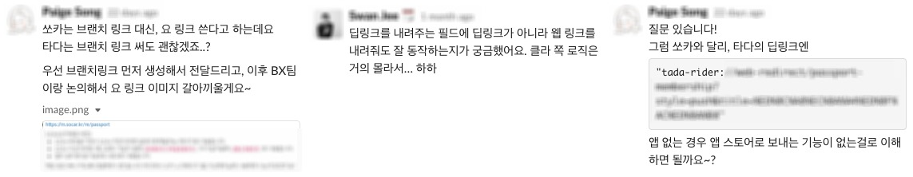
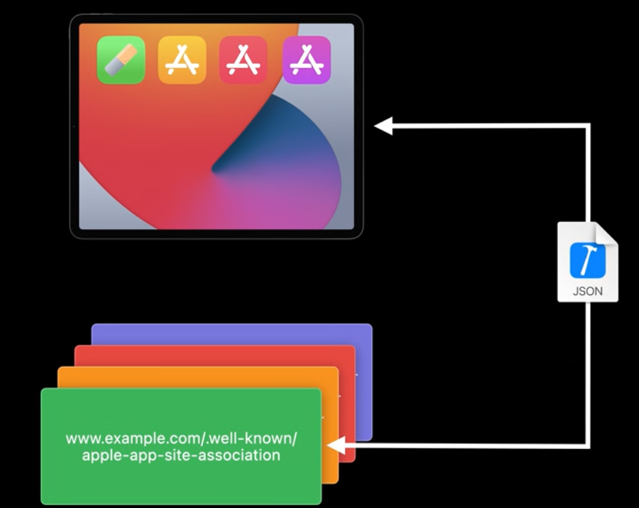
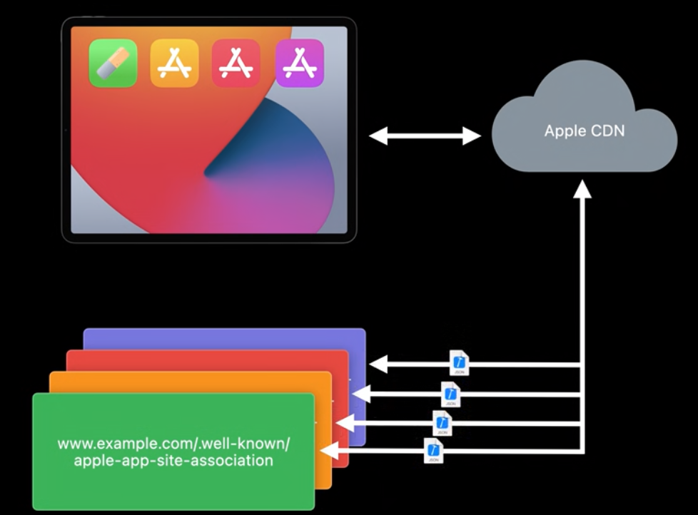
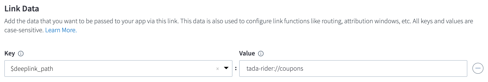

최근에 서비스에서 중요한 기능을 개발하면서 해당 화면으로 사람들을 유도할 수 있는 링크에 대한 질문을 많이 받았습니다.
이와 관련된 답변을 준비하다 보니 url 을 통해 어떻게 설치되어 있으면 앱을 열고 설치되어 있지 않은 앱들은 앱스토어로 보내는 지에 대한 이해가 부족하다고 느꼈습니다.
관련된 3rd party 서비스 [Branch](https://branch.io/) 가 어떤 기능들을 제공해주는지에 대한 이해도 필요했습니다.
관련된 기능을 개발해본 적 없는 모바일 개발자 혹은 모바일 플랫폼에 대한 이해도가 부족한 서버 개발자분들의 이해를 돕고자 간단하게 정리했습니다. 설명은 iOS 중심으로 정리되어 있습니다.

<!--truncate-->

# Deeplink

"탑승내역을 보여주는 화면으로 보내는 딥링크가 뭐에요?" 와 같이 공지사항 혹은 여러 마케팅 이벤트를 통해 사용자를 특정 화면으로 유도하려는 노력을 많이 합니다.
이와 같이 딥링크란 사용자를 도메인 내의 어떤 곳으로 안내하는 링크를 말합니다.

- [https://nytimes.com](https://nytimes.com/) 는 최상위 도메인으로 도메인 내 더 깊은 곳으로 안내하지 않기 때문에 딥링크가 아닙니다.
- [https://www.hbe.io/about](https://www.hbe.io/about) 는 도메인 내 상세정보에 해당하는 about 페이지, 특정 화면으로 향하는 딥링크입니다.

## Scheme, Path, Parameter

URL(Uniform Resource Locator) 은 `scheme://host:port/path?query` 의 형태로 리소스에 대한 위치를 나타냅니다.
모바일 플랫폼에서 각 서비스는 자신들의 앱을 띄울 수 있는 scheme 을 정의할 수 있습니다. 페이스북은 `fb://` 를 scheme 으로 쓰고 있어 사파리에서 `fb://` 와 같이 입력하면 시스템은 입력한 scheme 해당하는 앱(페이스북)을 엽니다.

모바일 개발자들은 custom scheme 으로 정의된 URL 을 통해 사용자를 어떤 화면으로 보내고 어떤 행동을 유도할 지 설계합니다.
예를 들어 메신저로 쿠폰을 선물하여 링크를 눌렀을 때 쿠폰화면을 보여주면서 선물 받은 쿠폰 코드를 자동으로 입력하는 기획이 나왔습니다.
`custom-app-scheme://coupons?code=오픈기념이벤트` 로 path 는 쿠폰 화면 이동을, query 로는 쿠폰 코드를 전달하여 사용자 경험을 개선할 수 있습니다.

```swift
switch url.host?.lowercased() {
  case "coupons":
    return actionableItem.ensureLoggedIn()
            .onStep { mainActionableItem -> /* 로그인 되었는지 확인하여 메인 화면을 띄운다. */ }
            .onStep { menuActionableItem -> /* 쿠폰화면을 띄운다 */ }
            .onStep { couponActionableItem -> /* 입력창에 쿠폰 번호를 채운다. */ }
  case "...":
    /* Handle cases. */
}
```

이렇게 개발자들이 정의해놓은 URL 에 대해서만 사용자를 원하는 화면으로 도달하게 할 수 있습니다.
정의되어 있지 않은 경우에는 개발자가 URL 에 대한 처리를 추가하여 앱을 업데이트해야 합니다.
`custom-app-scheme://web?url=www.example.com/features` 와 같이 웹페이지 띄우는 처리를 정의해놓으면 다양한 이벤트를 유연하게 대응할 수 있습니다.
어떤 앱이 어떤 scheme 을 쓰고 어떤 화면을 띄우는지 파악할 수 있으면 앱을 자유롭게 띄워 정보를 전달하여 사용성을 높일 수 있습니다.
예를 들어 내 위치를 친구에게 공유하고 싶을 때 line://message="" 딥링크를 사용하여 친구에게 바로 메세지를 전달할 수 있게 하면 사용자에게 좀 더 부드러운 경험을 제공할 수 있습니다.

iOS 에서는 `UIApplication.shared.canOpenURL` 이라는 API 를 이용하여 앱의 설치 유무도 파악할 수 있었습니다. 이 기능을 활용하면 내 앱을 사용하는 사람이 어떤 앱을 설치했는지도 파악할 수 있었습니다.
하지만 iOS 9 부터 개인정보보호를 위해 이런 API 의 사용을 제한합니다. 다른 앱을 띄우려면, 혹은 위와 같이 `canOpenURL` API 를 이용하려면 whitelist 에 등록해야 합니다.
whitelist 에 등록하지 않은 앱을 띄우려 시도하면 "This app is now allowed to query for scheme xxx" 로그가 찍히며 시스템 API 가 동작하지 않습니다.

또한 정의한 scheme 으로 앱을 여는 과정은 중복을 따로 막지 않았기 때문에 모방하는 앱에 대한 대응도 어려웠습니다.
예를 들어 Reddit 을 모방하는 Redd1t 이 `reddit://` scheme 을 쓰게 되면 어떤 앱이 뜰지 보장할 수 없는 상태였습니다.
Universal Link 는 URL 진입 시 URL 에 맞는 앱이 설치되어 있으면 앱을 띄우고 설치되어 있지 않다면 브라우저를 띄우는 기능입니다.
예를 들면 링크 https://www.facebook.com/watch 클릭 시 페이스북이 설치되어 있으면 페이스북 앱에서 watch 탭으로 이동하고 아니면 페이스북 watch 페이지를 브라우저에서 띄웁니다.
앱이 없으면 그에 대응하는 웹페이지를 볼 수 있으니 앱이 없을 때 아무 동작하지 않는 scheme 처리보다 사용자에게 더 좋은 경험을 줄 수 있다.

## Behind the scenes


출처: [WWDC 2020 What's new in Universal Link](https://developer.apple.com/videos/play/wwdc2020/10098/)
Universal Link 를 활성화 시키기 위해서는 앱에 어떤 도메인을 쓸 것인지 명시해야 합니다.
시스템은 앱을 다운 받아 설치할 때, 등록된 도메인의 AASA 파일을 파싱하여 Universal Link 를 활성화 시킵니다.

```json
// AASA JSON Example
{
  "applinks": {
    "apps": [],
    "details": [
      {
        "appIDs":[
          "A1B2C3D4E5.com.example.app",
          "F1G2H3I4J5.com.example.app"
        ],
        "components":[
          {
            "/": "/*/order/"
          },
          {
            "/": "/taco/*",
            "?":{ "cheese":"?*" }
          }
          {
            "#": "coupon-1???",
            "exclude": true
          },
          {
            "/": "",
            "#": "coupon-????"
          }
        ]
      }
    ]
  }
}
```

사용자가 앱스토어에서 앱을 다운받아 설치하면 시스템에서 앱에 등록된 도메인의 AASA 파일을 다운, 파싱하여 Universal Link 를 활성화 시킵니다.
시스템은 AASA 의 업데이트 된 내용을 반영하기 위해 주기적으로 AASA 파일을 다운로드 합니다.



"applinks", "apps" 는 템플릿의 형태로 Universal Link 선언이라고 보면 됩니다.

"details" 부분이 어떤 앱을 처리할지, 어떤 경로를 처리할지 명시하는 부분으로 여기서 appID 는 teamID 와 bundleID 의 조합입니다.
예를 들어 [타다](https://tadatada.com/)는 bundleID = kr.co.vcnc.tada 이기 때문에 A1B2C3F4D5.kr.co.vcnc.tada 와 같이 appID 를 정의할 수 있습니다.
도메인은 고유하고 어떤 앱이 뜰지 명시되어 있기 때문에 모방하는 서비스가 뜰 일은 없게 됩니다.
([스카이스캐너 AASA](https://www.skyscanner.co.kr/apple-app-site-association) 를 보면 bundleID `net.skyscanner.iphone-china` 를 보아 중국 쪽 아이폰 앱을 따로 제공하는 걸 볼 수 있습니다.)

"components" 리스트를 처리하는 부분을 하나씩 보면, "/\*/order/" 는 2번째 order 들어오는 모든 path 를 처리합니다.
예를 들면 https://example.com/taco/order/, https://example.com/salad/order/ 는 앱이 설치되어 있으면 앱을 띄웁니다.

예를 들어 https://example.com#coupon-1234 와 달리 https://example.com#coupon-5678 는 universal link 처리됩니다.

## Branch Quick Links

링크 설정에서는 사용자가 앱이 설치되어 있지 않았을 때 어디로 보낼지 정할 수 있습니다. 보통 모바일 플랫폼에서는 해당 스토어로 보내고 PC 에서 링크를 접속했을 때는 대표 홈페이지로 이동합니다.

AASA 파일에 exclude 옵션을 이용하여 `/e/*` 를 제외시키도록 등록해놓고 https://tadatada.test-app.link/e/6us6DGSmg3 처럼 바꿔 Universal Link 가 동작하지 않게 합니다.

Link Data 설정에서는 `$deeplink_path` 를 이용하여 사용자를 어디로 보낼지 명시할 수 있습니다.

위에서 https://tadatada.test-app.link/6us6DGSmg3 링크를 만들어 앱이 설치되어 있는 경우에는 쿠폰함으로, 앱이 설치되어 있지 않은 경우에는 앱스토어로 이동하게 설정하였습니다.

앱 개발자는 앱이 어떤 URL 을 통해서 열렸는지 처리할 수 있습니다.
Branch SDK 에게 앱 관련된 이벤트를 알려주면 해당 URL 에 맞는 정보들을 내려주고 앱 개발자는 그 정보에 맞춰 사용자를 원하는 화면으로 이동시킵니다.

```js
window.onload = function () {
  window.top.location = validateProtocol(
    "tada-rider://coupons?link_click_id=933889898695179390"
  );
  setTimeout(function timeout() {
    if (document.webkitHidden || document.hidden) {
      return;
    }
    // 유효한 링크, 버전 체크한 후 다른 페이지로 이동한다.
    if (isSafari12Dot3OrGreater()) {
      if (window.confirm("Open in App Store?")) {
        window.top.location = validateProtocol(
          "https://tadatada-alternate.test-app.link/6us6DGSmg3?__branch_flow_type=viewapp&__branch_flow_id=933889898728733824&_t=933889898695179390"
        );
      }
    } else {
      window.top.location = validateProtocol(
        "https://tadatada-alternate.test-app.link/6us6DGSmg3?__branch_flow_type=viewapp&__branch_flow_id=933889898728733824&_t=933889898695179390"
      );
    }
  }, 250);
};
```

자바스크립트는 URL 이 유효한지 파악하고 잠시 후 https://tadatada-alternate.test-app.link/6us6DGSmg3?__branch_flo... 로 이동시킵니다.
Redirect 된 URL 에서 파라미터들은 사용자가 어떤 경로로 유입됐는지 파악하기 위한 값으로 추정됩니다. Redirect 된 URL 은 사용자를 다시 앱스토어로 이동시킵니다.

```bash
curl \
  -i \
  --user-agent "Mozilla/5.0 (iPhone; CPU iPhone OS 12_2 like Mac OS X) AppleWebKit/605.1.15 (KHTML, like Gecko) Mobile/15E148" \
  https://tadatada-alternate.test-app.link/6us6DGSmg3\?__branch_flow_type\=viewapp\&__branch_flow_id\=...\&_t\=...
# HTTP/2 307
# location: itms-apps://apps.apple.com/app/id1422751774
# server: openresty
# date: Fri, 18 Jun 2021 05:57:09 GMT
# x-powered-by: Express
# set-cookie: _s=BWZNsu%2Buq5%2FpiBuSvq%2BnG4sHM4PMjC9uHvkp3nVZoXCqsJFF0keX%2BDLaMDCVWt5b; Max-Age=31536000; Domain=.test-app.link; Path=/; Expires=Sat, 18 Jun 2022 05:57:09 GMT
# x-cache: Miss from cloudfront
# via: 1.1 6417e2f7bfaa7aa3312c9889248048c4.cloudfront.net (CloudFront)
# x-amz-cf-pop: ICN54-C3
# x-amz-cf-id: dRzKRp0aI0dyjdjbLIUkfO05plWxKYyRbkuIWXHOvOGpj4lDSCha1w==
```

https://tadatada.test-app.link/6us6DGSmg3 를 PC 에서 접속하면 설정해놓은 대표 홈페이지로 바로 이동시킵니다.

```bash
curl \
  -i \
  --user-agent "Mozilla/5.0 (Macintosh; Intel Mac OS X 10_15_7) AppleWebKit/537.36 (KHTML, like Gecko) Chrome/91.0.4472.106 Safari/537.36" \
  https://tadatada.test-app.link/6us6DGSmg3
# HTTP/2 307
# location: https://tadatada.com/?_branch_match_id=940263651360554710&utm_medium=marketing
# server: openresty
# date: Fri, 18 Jun 2021 05:52:36 GMT
# x-powered-by: Express
# set-cookie: _s=M1lGlTim6AxpMnxz8MbAf9xPim3iWchdngQ5h3bxIiHwbjKbSHV%2BhaQxl%2FvWA%2B8E; Max-Age=31536000; Domain=.test-app.link; Path=/; Expires=Mon, 04 Jul 2022 16:02:30 GMT; Secure; SameSite=None
# last-modified: Sun, 04 Jul 2021 16:02:30 GMT
# x-cache: Miss from cloudfront
# via: 1.1 fd68ec93b50a400ce670e5ce6a8134ba.cloudfront.net (CloudFront)
# x-amz-cf-pop: ICN55-C1
# x-amz-cf-id: lL-kCf8mMMKiVID6exN_-vbPgx5T1-I8OaMccsD271DF9uuwx3ywPg==
```

# Conclusion

Universal Link 는 URL 클릭 시 바로 앱으로 진입하거나, 앱이 설치되어 있지 않은 경우 웹페이지를 띄워 사용자에게 더 좋은 경험을 제공합니다.
동작 방식은 거의 동일하며 AASA 파일과 동치되는 JSON 파일을 웹서버에서 제공하면 됩니다. (https://www.facebook.com/.well-known/assetlinks.json, 페이스북 App Links 파일)
그래서 WebView 의 custom user agent 를 일반 포맷과 다른 형태로 설정하고 웹페이지에서 Branch 링크를 사용하면 원하는 방향으로 동작 안할 수 있습니다.

- [WWDC 2019 What's new in Universal Links](https://developer.apple.com/videos/play/wwdc2019/717/)
- [WWDC 2020 What's new in Universal Links](https://developer.apple.com/videos/play/wwdc2020/10098/)
