디자이너 분들과 일할 때 AutoLayout Constraint 를 제대로 걸었음에도 "중앙정렬이 안맞는 것 같아요. 여기 텍스트 정렬이 어색해요" 와 같은 얘기를 들을 때가 종종 있었습니다.
실제로 UILabel 은 지정한 Font 크기보다 크게 잡히며 중앙정렬이 안되어 있는 것처럼 보였습니다.
이와 관련해서 왜 더 크게 잡히는지, 정렬이 어떤 식으로 동작하는지, Font 가 Label 에 어떤 영향을 미치는지 간단한 용어와 개념부터 소개하겠습니다.

<!--truncate-->

# Typography Terminology

정렬이 왜 이상한지를 설명하기에 앞서 먼저 용어를 알고 갈 필요가 있습니다. 아래 보이는 이미지는 애플 문서 Font Handling 에 있는 이미지로 글자를 그릴 때 필요한 선들을 나타냅니다.

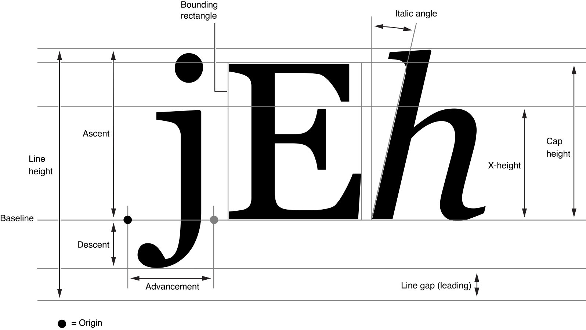

<small>출처: [Apple Font Handling](https://developer.apple.com/library/archive/documentation/TextFonts/Conceptual/CocoaTextArchitecture/FontHandling/FontHandling.html)</small>

많은 용어들이 있음에도 이 글에서 필요한 `Baseline`, `Ascent(Ascender)`, `Descent(Descender)`, `CapHeight`, `x-Height`, `LineHeight`, `Leading(Line gap)` 정도만 알면 됩니다.

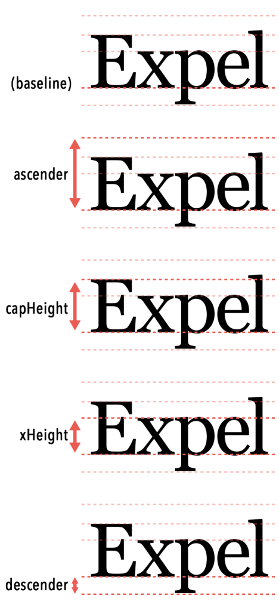

<small>출처: [iOS Tracking Typography](https://www.rightpoint.com/rplabs/ios-tracking-typography)</small>

먼저 `Baseline` 은 문자가 서있는 보이지 않는 선입니다. 이 선을 기준으로 문자들을 만듭니다.
`Ascent(Ascender)` 는 Baseline 으로부터 문자의 가장 윗 부분까지 거리를 나타냅니다.
`Descent(Descender` 는 Baseline 으로부터 문자의 가장 아랫 부분까지 거리를 나타냅니다. 여기서 줄간격 `Leading`은 포함하지 않습니다.
`CapHeight` 는 basline 으로부터 대문자가 차지하는 높이, `x-Height` 는 baseline 으로부터 소문자 x 가 차지하는 높이입니다.
`LineHeight` 는 한 줄이 차지하는 높이를 말하며, 애플 문서에 있는 그림은 줄간격 `Leading` 을 포함하고 있습니다.
허나 실제로 iOS 개발에서는 포함되지 않습니다. 그래서 `LineHeight` 는 `Ascent` + `Descent` 의 합이 됩니다.

[What If Your Designers Want a Baseline Grid on iOS?](https://medium.com/mobimeo-technology/what-if-your-designers-want-a-baseline-grid-on-ios-d5234c7b52c0) 글을 참조하여 여러 TextStyle 의 정보를 출력하면 `LineHeight` 에 `Leading` 이 포함되지 않는 걸 알 수 있습니다.
예를 들어 Title 이 lineHeight: 71.6015625, ascender: 57.12890625, descender: -14.47265625, leading: -1.6015624999999956 와 같이 나오면서 lineHeight = ascender + descender 임을 알 수 있습니다.

# Alignment Examples

위에서 정의한 개념들을 통해 몇몇 문제가 되는 정렬들을 살펴보고 해결해보려 합니다.

## Baseline Offset

몇몇 사람들은 디자인의 90%가 타이포그래피 라고 합니다. 그만큼 사람들한테 글을 잘 읽히게 하려면 줄 간격도 중요합니다.
그래서 많은 디자이너 분들이 lineHeight 를 수정하여 가독성을 좋게 만드려고 노력합니다.

<!--  -->

iOS 에서는 위와 같이 코드를 작성하여 원하는 lineHeight 를 설정할 수 있습니다.

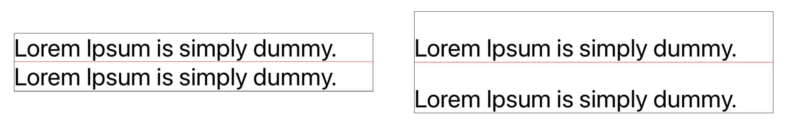

<small>출처: [UILabel line height in Swift](https://www.belkadigital.com/articles/uilabel-line-height-in-swift)</small>

근데 위 이미지와 같이 문자들이 중앙정렬 되는 게 아니라 아랫부분에 붙어 있어서 예상치 못하게 상단 부분이 비어 보일 수 있습니다.
여러 줄의 UILabel 을 화면 중앙에 정렬해도 상단이 비어보이면서 중앙 정렬이 아닌 것처럼 보일 수 있습니다.

<!--  -->

또 다른 상황으로 NSAttributedText 에 다른 Font 크기를 지정하면 baseline 을 기준으로 정렬됩니다.

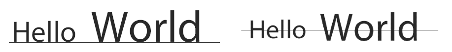

<small>출처: [UILabel line height in Swift](https://www.belkadigital.com/articles/uilabel-line-height-in-swift)</small>

왼쪽 이미지가 아닌 오른쪽 이미지처럼 중앙 정렬을 원하는 경우는 어떻게 해야 할까요?

### Solution - baselineOffset

위와 같은 문제들을 NSAttributedString 의 baselineOffset 설정으로 해결할 수 있습니다. 문자들을 Baseline 으로부터 간격을 주어서 중앙에 정렬하는 것처럼 보이게 합니다.

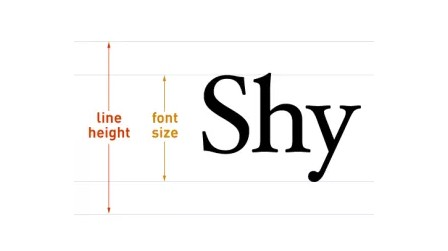

<small>출처: [UILabel line height in Swift](https://www.belkadigital.com/articles/uilabel-line-height-in-swift)</small>

baseline offset 은 Baseline 으로 부터 얼마나 떨어져 있는 지를 나타냅니다. 설정한 lineHeight 에서 Font 크기를 빼고 나누기 2 한 값을 offset 으로 설정하면 될 것 같습니다.

<!--  -->

하지만 실제로는 나누기 2 가 아닌 나누기 4 를 해야 중앙 정렬이 됩니다. (내부적으로 scale 계산을 하는 건지, 여러 블로그글을 참고했으나 아직까지 정확한 사유를 파악하지 못했습니다.)

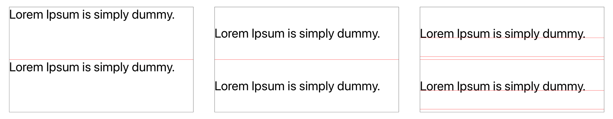

<small>출처: [UILabel line height in Swift](https://www.belkadigital.com/articles/uilabel-line-height-in-swift)</small>

- 첫번째 이미지는 baselineOffset 을 적용하기 전,
- 두번째 이미지는 baselineOffset 을 `(lineHeight - font.lineHeight) / 4` 으로 적용한 상황
- 세번째 이미지는 baselineOffset 을 `(lineHeight - font.lineHeight) / 4` 을 적용하고 `(lineHeight - font.lineHeight) / 2` 를 이용하여 빨간 선을 그려주었습니다.

## CapHeight Alignment

다음은 Font 크기가 다른 두 UILabel 을 상단으로 맞추는 경우 입니다.

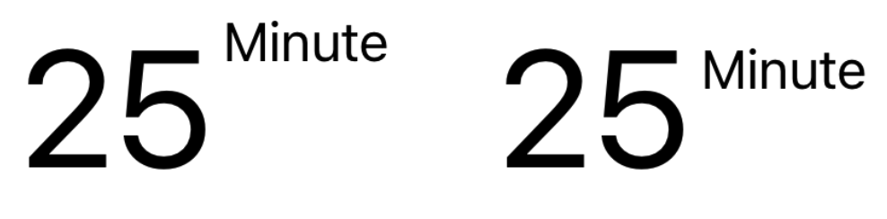

Font 크기가 다른 두 UILabel 상단을 맞췄음에도 불구하고 왼쪽 이미지처럼 실제로 보이는 글자 정렬은 이상해보입니다.
오른쪽 처럼 이쁘게 정렬되게 하려면 어떻게 해야 할까요?

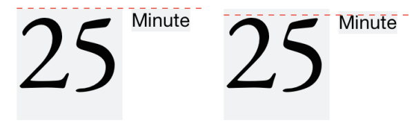

<small>출처: [iOS Tracking Typography](https://www.rightpoint.com/rplabs/ios-tracking-typography)</small>

왼쪽 이미지 처럼 UILabel 의 상단을 맞추는 것이 아닌 CapHeight 선을 맞추면 오른쪽 그림처럼 깔끔하게 해결할 수 있습니다.

<!--  -->

가장 쉬운 구현으로는 위 코드 처럼 두 UILabel 의 상단을 맞추던 AutoLayout Constraint 에 (Ascender - CapHeight) 차이를 설정하는 방법이 있습니다.

<!--  -->

다른 방법으로는 UIView 의 `alignmentRectInsets` 값을 이용하는 방법입니다.
값을 override 하면서 View 내부에서 top 에 대한 정의를 바꿉니다.

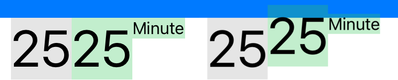

위 이미지는 `alignmentRectInsets` 를 덮어쓰는 `CapAlignmentLabel` 를 정의하여 비교해본 결과입니다.
왼쪽 이미지는 스토리보드에서의 프리뷰이며 오른쪽 이미지는 실제로 디바이스에서 작동한 결과입니다.
연한 초록색이 `CapAlignmentLabel` 영역을 나타냅니다.
파란색 View 밑에 25 가 써진 `CapAlignmentLabel` 를 붙인 후 양 옆에 Label 들을 25 가 써진 `CapAlignmentLabel` 상단에 맞췄습니다.
`font.ascender - font.capHeight` 만큼 텍스트가 위로 올라간 걸 볼 수 있습니다.

### More Accurate CapHeight

좀 더 정확한 위치를 잡기 위해서는 실제로 Text 가 UILabel 에서 어떻게 그려지는 지 파악해 볼 필요가 있습니다.
Helvetica Font 24pt 는 lineHeight 27.6, ascender 22.08, descender -5.52, capHeight 17.27 값을 가집니다.
iOS 에서는 실제로 Text 를 그릴 때 이러한 Fractional part(pxiel 영역으로 나눠지지 않는 값들)를 anti-aliasing 을 사용하여 그립니다.

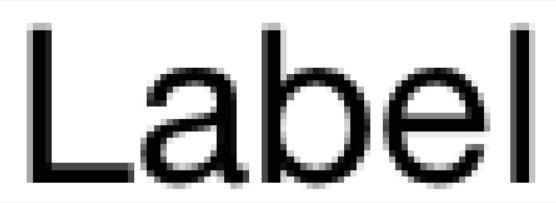

<small>출처: [Cap Height Alignment for iOS Auto Layout](https://www.atimi.com/cap-height-alignment-for-ios-auto-layout/)</small>

글자들은 Baseline 위에서 그려지는데, 이 Baseline 은 pixel 영역이라서 Fractional part 를 pixel 영역에 맞게 처리해야 합니다.
근데 여기서 round 를 써서 실제 글자가 차지하는 pixel 보다 작아지면 잘릴 수도 있으니 ceil 을 이용하여 한 픽셀 정도 넉넉하게 잡아줍니다.

<!--  -->

## Baseline Alignment

또한, iOS 에서 firstBaselineAnchor, lastBaselineAnchor 를 Auto Layout 으로 제공하여 Baseline 에 맞게 정렬할 수 있습니다.

<!--  -->

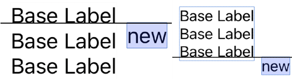

<small>출처: [FirstBaseLineNachor & LastBaseLineAnchor](https://milyo-codingstories.tistory.com/51)</small>

"new" Label 상단을 "Base Label" 의 firstBaselineAnchor 에 걸게 되면 왼쪽 이미지와 같이 나타납니다.
오른쪽 이미지는 lastBaselineAnchor 를 이용했습니다.

# Conclusion

이번 글에서는 Font 에서 쓰이는 간단한 개념들과 그 개념들을 어떻게 이용할 수 있는 지를 정리해봤습니다.
개발을 하면서 이상항 정렬로 Typography 에 대해 공부해봐야겠다고 생각했던 적이 있었는데, 간단한 용어만 알아도 실무에서 요구하는 디자인 문제는 어느 정도 해결할 수 있을 것 같습니다.
가독성을 위해 LineHeight 를 직접 설정하는 경우, Font 크기가 다른 두 Label 을 정렬하는 경우는 꽤 빈번해서 위에서 설명한 개념들을 유용하게 쓸 수 있을 것 같습니다.

# Reference

- [Cap height Alignment for iOS Auto Layout](https://www.atimi.com/cap-height-alignment-for-ios-auto-layout/)
- [UILabel line height in Swift](https://www.belkadigital.com/articles/uilabel-line-height-in-swift)
- [Label 의 LineHeight 설정 및 가운데 정렬](https://sujinnaljin.medium.com/swift-label%EC%9D%98-line-height-%EC%84%A4%EC%A0%95-%EB%B0%8F-%EA%B0%80%EC%9A%B4%EB%8D%B0-%EC%A0%95%EB%A0%AC-962f7c6e7512)
- [iOS Tracking Typography](https://www.rightpoint.com/rplabs/ios-tracking-typography)
- [UILabel line height, letter spacing and more ](blog.eppz.eu/uilabel-line-height-letter-spacing-and-more-uilabel-typography-extensions/)
- [What If Your Designers Want a Baseline Grid on iOS?](https://medium.com/mobimeo-technology/what-if-your-designers-want-a-baseline-grid-on-ios-d5234c7b52c0)
- [Getting to the bottom of line height in Figma](https://www.figma.com/blog/line-height-changes/)
