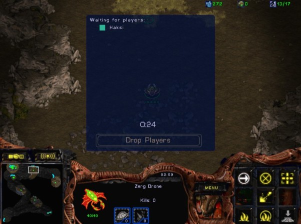
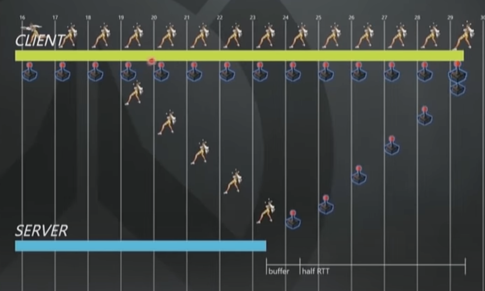

import picoTankVideo from './remove-animations-pico-tanks.mp4';

모빌리티 플랫폼 '타다' 개발에서 탑승 플로우(호출 - 호출 중 - 매칭 - 탑승 - 탑승 완료)를 앱에서 잘 보여주는 것이 매우 중요합니다.
호출을 하고 있다가 시간 만료로 취소가 되거나 매칭이 되었지만 드라이버가 사정이 생겨 취소하는 경우 등 탑승자의 아무런 입력 없이도 앱에서 탑승 상태를 잘 나타내야 합니다.
서버에 탑승 상태를 모바일 앱에서 잘 보여주기 위한 방법들을 고민하다가 멀티플레이어 게임에서의 어떻게 다른 플레이어들과 동시간대에 있는 것처럼 동기화가 잘되는지가 궁금해졌습니다.
멀티플레이어 게임을 하다보면 다양한 플레이어들의 상호작용이 있는데 이걸 어떻게 끊김 없이 보여주고 있는지 궁금해져서 관련된 기술들을 찾아서 정리해봤습니다.

<!--truncate-->

# How to synchronize the events

여러 사용자가 참여하는 게임에서 동기화 방식은 다양합니다.
발생한 입력을 모아 클라이언트가 시뮬레이션하거나 서버에서 입력을 모아 시뮬레이션 후 클라이언트에서는 해당 상태를 자연스럽게 보여줄 수 있습니다.

## Lockstep

출처: [멀티플레이 게임의 동기화 기법 시리즈 2편: 이벤트 동기화](https://blog.naver.com/linegamedev/221061964789)

Lockstep 은 라운드마다 서버가 플레이어들의 입력을 모아서 클라이언트들에 전송하여 시뮬레이션을 클라이언트에서 진행합니다.
일관성 유지를 위해 모든 단계를 맞춰가면서 진행됩니다.
하나의 라운드 내에서 모든 이벤트들에 순서가 매겨지게 되며, 예외가 발생하는 것을 미리 방지합니다.
가장 처리가 느린 클라이언트 위주로 진행되기 때문에 레이턴시가 큰 유저가 있으면 멈춤이 발생합니다.
참가자 수가 적은 RTS 에서 사용하고 참가자 수가 늘어날 수록 입력 패킷 도달 지연이 발생할 가능성이 큽니다.

출처: [멀티플레이 게임의 동기화 기법 시리즈 2편: 이벤트 동기화](https://blog.naver.com/linegamedev/221061964789)

서로 다른 클라이언트 간 지연으로 피하기 위해 시간을 정해 라운드를 진행할 수도 있습니다.

아래 그림은 클라이언트에서 입력만을 교환해서 시뮬레이션하는 lockstep 에 대한 예시입니다.
서로의 상태를 hash value 로 항상 비교합니다.
주로 RTS 혹은 과거 AOS 게임에서 쓰는 방식입니다.

출처: [[NDC] CAP 이론을 통한 네트워크 동기화 기법](https://youtu.be/j3eQNm-Wk04)

1초에 20번 업데이트하는 게임에서 50ms 당 라운드를 가집니다.
각 클라이언트는 이벤트 큐가 존재하고 라운드마다 이벤트를 처리합니다.
네트워크 상황에 따라 이벤트를 처리하는 시점이 다를텐데 여기서 '나' 와 '상대2' 에 대한 이벤트를 받았지만 '상대1' 에 대한 이벤트는 받지 못한 상황입니다.

출처: [[NDC] CAP 이론을 통한 네트워크 동기화 기법](https://youtu.be/j3eQNm-Wk04)

'상대1' 의 이벤트까지 모이면 해당 라운드를 시뮬레이션해서 처리합니다.

출처: [[NDC] CAP 이론을 통한 네트워크 동기화 기법](https://youtu.be/j3eQNm-Wk04)

'나' 와 '상대2' 의 이벤트는 계속 전달되고 있지만 '상대1' 은 네트워크 불안정으로 인해 이벤트를 받지 못한다면 해당 라운드 처리가 불가합니다.

| 상대방을 기다리는 상황 | 기다리다 상대방을 내쫓은 상황 |
|  |  |

출처: [Robocop's Starcraft Page](http://starcraft.burningblade.org/stories/index.html)

게임 스타크래프트를 해봤으면 위와 같은 팝업들을 많이 보셨을 겁니다. 라운드 처리를 위해 상대방 이벤트를 기다리다가 쫓은 상황입니다.

출처: [Robocop's Starcraft Page](http://starcraft.burningblade.org/stories/index.html)

위와 같은 상황처럼 lockstep 에서는 동기화 주기가 중요합니다.
스타크래프트에서는 위 이미지와 같은 네트워크 옵션 선택이 있었는데 low latency 는 자주 동기화 하겠다는 뜻입니다.
자주 동기화하면 플레이어가 빠른 반응을 느낄 수 있지만 한 플레이어라도 늦으면 바로 멈추는 상황이 생겨버립니다.

## Authoritative Server

라운드를 가지는 lockstep 과 다르게 라운드 없이 모든 이벤트를 지속적으로 받아 서버가 판단하는 방식입니다.
클라이언트에서 발생하는 이벤트를 서버로 전달, 서버에서는 이벤트를 모아 시뮬레이션하여 상태 변화를 클라이언트로 보냅니다.
클라이언트는 과거의 서버 상태를 재생하는 형태입니다. 그래서 클라이언트마다 일관성이 안맞을 수 있습니다.

출처: [배틀그라운드 트레이서 현상](https://m.post.naver.com/viewer/postView.nhn?volumeNo=11513471&memberNo=16036253)

위 영상은 실제로 버그였지만 위 영상과 같이 클라이언트와 서버 상태가 다른 경우 그에 맞게 다시 되돌아가는 현상이 생길 수 있습니다.

출처: [Overwatch Gameplay Architecture and Netcode](https://youtu.be/W3aieHjyNvw)

게임 오버워치에서 '트레이서' 라는 캐릭터가 클라이언트에서는 움직이고 있다가 다른 플레이어의 공격으로 인해 기절한 상황입니다.
서버에서 기절 상태를 전송받기 전까지는 클라이언트는 계속 이동상태를 보여줍니다.

출처: [Overwatch Gameplay Architecture and Netcode](https://youtu.be/W3aieHjyNvw)

서버에서 기절 상태를 받게 되면 그 시점부터 일정 시간 동안 클라이언트에서 기절 상태를 보여줍니다.

출처: [Overwatch Gameplay Architecture and Netcode](https://youtu.be/W3aieHjyNvw)

서버에서 받은 정보를 기반으로 기절 상태가 언제 끝나는지 클라이언트가 알기 때문에 기절 상태가 끝나면 원래 상태로 복구합니다.
위 이미지에서는 30-32 frame 이 클라이언트에서 기절 시간 후에 원래 상태로 복구하는 것을 나타냅니다.

### Time Synchronization

먼저 서버와 다수의 클라이언트에서 사용하는 시간 정보를 맞춰야 클라이언트에서 발생하는 이벤트 순서를 정할 수 있습니다.
이벤트 순서에 따라 그 이후에 이루어지는 상황이 변할 수 있으니 시간 동기화는 굉장히 중요합니다.
머신에서 제공하는 타임스탬프 값을 사용하여 이벤트가 발생한 시점 정보를 공유할 수 있는데, 문제는 머신마다 시간 정보에 미세한 차이가 있을 수 있습니다.
그래서 서버에서 시간을 결정하고 클라이언트에게는 현재 시간을 파악하는 API 를 제공합니다.

출처: [멀티플레이 게임의 동기화 기법 시리즈 1편: 시간 동기화](https://blog.naver.com/linegamedev/221060368580)

위 그림처럼 클라이언트가 현재 시간을 알려달라는 API 를 호출 - 서버는 클라이언트 요청을 받아 현재 시간을 반환 - 반환한 값이 클라이언트까지 돌아오게 됩니다.
실제로 서버가 응답을 받았을 때에 대한 시간을 클라이언트가 알기 어렵기 때문에 통계적으로 추정합니다.
간단한 방법으로, 여러 번 API 를 호출하여 평균과 표준편차를 구해 구간을 벗어나는 데이터는 전부 이상치로 간주할 수도 있습니다.

### Tick Rate

서버에서는 클라이언트의 입력을 받아 시뮬레이션 한 결과값을 클라이언트에 알려주는데 이러한 과정을 얼마나 자주할지도 게임을 플레이하는 플레이어한테 많은 영향을 끼칩니다.
자주하게 되면 더 정확한 판정, 되감기에도 유리하지만 높은 네트워크 대역과 CPU 를 요구하기 때문에 회사에서는 큰 비용을 부담해야 합니다.
오버워치는 Broadcast 비율을 20Hz 정도로 서버에서 1번 업데이트가 클라이언트에서는 3-4 frame 을 차지합니다.
1 frmae 은 16ms 정도로 서버의 약 48ms 늦은 상태를 보고 있다는 뜻입니다.

### Area of Interest

서버는 클라이언트에게 시뮬레이션 한 결과값을 알려주는데 Tick Rate 는 얼마나 자주할건지에 대한 얘기라면 Area of Interest 는 어디까지 알려줘야하는가 입니다.
범위가 넓으면 패킷 처리량이 많아지고 보안에 좋지 않습니다.
배틀그라운드의 경우 원거리 저격에 떄문에 멀리 있는 적 정보까지 동기화 해야 하는데, 클라이언트 메모리 정보만으로 많은 정보들을 확보할 수 있어 다양한 핵이 나올 수 있습니다.
범위가 좁다면 갑자기 다른 플레이어가 튀어 나오는 경험 등 플레이어에게 안좋은 경험이기 때문에 개발사는 범위를 잘 고려해야 합니다.

### Snapshot and Delta

클라이언트가 입력을 보내면 서버가 시뮬레이션을 진행한 후 스냅샷을 배포하면 클라이언트들은 그 스냅샷을 적용합니다.
모든 객체의 상태를 동기화하기 때문에 객체가 늘어나면 스냅샷 크기가 커집니다.
스냅샷 크기를 조절하기 위해 수신자별 우선순위가 높은 변경점을 우선해서 발송하거나 발송빈도를 높여 스냅샷 크기 자체를 줄일 수도 있습니다.

# Synchronization Details

출처: [Fast-Paced Multiplayer (Part I): Client-Server Game Architecture](https://www.gabrielgambetta.com/client-server-game-architecture.html)

클라이언트와 서버 통신으로 인해 실제로 플레이어가 요청한 입력은 일정 시간 후에 처리됩니다.

출처: [Fast-Paced Multiplayer (Part II): Client-Side Prediction and Server Reconciliation](https://www.gabrielgambetta.com/client-side-prediction-server-reconciliation.html)

일정 시간 후에 동작하는 움직임은 플레이어들에게 그리 좋지 않은 경험입니다.

출처: [Fast-Paced Multiplayer (Part III): Entity Interpolation](https://www.gabrielgambetta.com/entity-interpolation.html)

변경된 상태를 서버에서 다른 클라이언트까지 보내는 데 추가로 시간이 들기 때문에 실제로 플레이어들은 일관성이 맞지 않는 경험을 자주 할 수 있습니다.

실제로 우리가 게임할 때 동시에 일어나는 것처럼 느끼는데 이러한 제약을 어떻게 극복하고 있는지를 찾아봤습니다.

## Prediction and Reconciliation

출처: [Fast-Paced Multiplayer (Part II): Client-Side Prediction and Server Reconciliation](https://www.gabrielgambetta.com/client-side-prediction-server-reconciliation.html)

간단한 해결책으로 서버 응답을 기다리지 않고 먼저 움직이는 것입니다.
근데 그렇게 하면 이후 서버에서 응답이 왔을 때 다시 전위치로 돌아갔다가 제위치로 돌아오게 됩니다.

출처: [Fast-Paced Multiplayer (Part II): Client-Side Prediction and Server Reconciliation](https://www.gabrielgambetta.com/client-side-prediction-server-reconciliation.html)

위 문제를 해결하기 위해 클라이언트는 입력 요청들을 저장해놓고 서버에서 오는 응답을 받을 때 이전 요청들이 처리되었는지 파악합니다.
처리 되었으면 저장된 입력 요청을 버리고 또 다시 오는 응답들을 저장한 입력과 비교해가면서 적용해갈 수 있습니다.

[Fast-Paced Multiplayer: Sample Code and Live Demo](https://www.gabrielgambetta.com/client-side-prediction-live-demo.html) 를 들어가서
Prediction(서버 응답이 오기 전에 미리 움직이기) 만 키면 먼저 움직였다가 돌아오는 걸 볼 수 있습니다.
여기서 Reconciliation(요청을 저장하고 서버에서 온 응답을 처리해가면서 적용) 을 키면 원래 자리로 돌아가지 않고 부드럽게 반영되는 걸 볼 수 있습니다.

출처: [Fast-Paced Multiplayer (Part II): Client-Side Prediction and Server Reconciliation](https://www.gabrielgambetta.com/client-side-prediction-server-reconciliation.html)

내가 움직이는 모습을 부드럽게 하는 건 어느 정도 처리한 것 같은데 다른 플레이어들과의 상황은 어떻게 처리할 수 있을까요?

## Dead Reckoning

출처: [Fast-Paced Multiplayer (Part III): Entity Interpolation](https://www.gabrielgambetta.com/entity-interpolation.html)

Dead Reckoning(DR)은 '추측 항법' 으로 쓰이기도 하는데 거리 및 방향을 계산하여 위치를 추적하는 기술입니다.
게임에서 Dead Reckoning 은 캐릭터의 이동경로를 예측하는 방법이라고 할 수 있습니다.
단순히 패킷에 좌표만 담는 게 아니라 속도, 가속도를 담아 전달하면 다른 클라이언트에서는 마지막으로 확인된 패킷의 정보를 통해 현재 위치를 유추할 수 있습니다.
즉, 위치, 향하는 방향 그리고 속도를 알고 있고 현재가 그 시점으로부터 어느 정도 시간이 흘렀는지를 알고 있다면 현재 위치를 계산할 수 있습니다.

출처: [〈카트라이더〉 0.001초 차이의 승부 - 300km/h 물체의 네트워크 동기화 모델 구현기](https://youtu.be/r4ZaolMQOzE)

카트라이더 같은 차량 경주 게임에서는 이러한 요소들이 굉장히 중요합니다.
순위를 가르는 경쟁에서 실제 서버에서는 내 위치가 상대방 보다 뒤에 있는데 앞에 있다고 보이면 안되니까요.

### Interpoliation and Extrapolation

<iframe width="560" height="315" src="https://www.youtube.com/embed/r4ZaolMQOzE?start=650&end=725"
  title="YouTube video player" frameborder="0"
  allow="accelerometer; autoplay; clipboard-write; encrypted-media; gyroscope; picture-in-picture; web-share"
  allowfullscreen>
</iframe>

Interpolation 은 0 과 1 값이 있을 때 0 과 1 사잇 값을 유추하는 거라면, Extrapolation Range 를 넘어선 2, 3을 유추하는 과정입니다.
패킷을 보낸 시각, 카트의 위치, 카트의 선형 속도, 각속도 등을 이용하여 상대방의 위치를 유추합니다.
클라이언트 간 시간을 맞추기 위해 서버 시간을 이용, 서버는 클라이언트에 현재 시간을 보냅니다.
클라이언트 시계와 서버 시계를 비교하여 델타를 구해 서버의 시간을 유추하고 패킷에 담습니다.

출처: [〈카트라이더〉 0.001초 차이의 승부 - 300km/h 물체의 네트워크 동기화 모델 구현기](https://youtu.be/r4ZaolMQOzE)

현재 위츠는 이전 프레임에서 계산된 위치입니다.
패킷을 받은 후에 속도와 시간을 이용하여 다음 위치를 계산, 여기서 Interpolation 한번 더해서 새로운 위치를 계산합니다. 각도도 같은 방법으로 계산합니다.
구체적인 내용은 [영상](https://youtu.be/r4ZaolMQOzE)을 참고해주세요.

위와 같은 계산을 이용하면 20ms 레이턴시를 가질 때 영상입니다.

<iframe width="560" height="315" src="https://www.youtube.com/embed/r4ZaolMQOzE?start=840&end=869"
  title="YouTube video player" frameborder="0"
  allow="accelerometer; autoplay; clipboard-write; encrypted-media; gyroscope; picture-in-picture; web-share"
  allowfullscreen>
</iframe>

200ms 레이턴시를 가질 때 영상입니다.

<iframe width="560" height="315" src="https://www.youtube.com/embed/r4ZaolMQOzE?start=880&end=920"
  title="YouTube video player" frameborder="0"
  allow="accelerometer; autoplay; clipboard-write; encrypted-media; gyroscope; picture-in-picture; web-share"
  allowfullscreen>
</iframe>

## Remove Animations

출처: [네트웍 동기화 개론과 고급 동기화 기법](https://noti.st/eiaserinnys/jCpSbp)

상대방은 타격 요청을 하고 바로 애니메이션이 시작하는데 서버에서 상대방의 타격 요청을 알려줬을 때는 상대방 클라이언트에서 이미 타격 애니메이션이 꽤나 진행된 상태일 것입니다.
실제로 동시에 타격판정이 일어나지 않아 보일 수 있다는 것이죠.

출처: [네트웍 동기화 개론과 고급 동기화 기법](https://noti.st/eiaserinnys/jCpSbp)

동시에 타격이 일어나게 하기 위해 중간에 애니메이션을 삭제하거나 빠르게 진행할 수 있습니다.

| 처리하지 않았을 때 | 동기화 처리를 했을 때 |
|  |  |

<video width="80%" controls>
  <source src={picoTankVideo} type="video/mp4"/>
</video>

출처: [PickoTanks Twitter](https://twitter.com/PickTanks/status/1097623864966819840)

위 영상 약 10초 부분에서 파란 탱크의 미사일이 갑자기 중간에 생기는 것을 볼 수 있습니다.

## Hit Registration and Lag Compensation

실제 타격 피해에 대해서는 클라이언트에서 처리하면 많은 부정행위 떄문에 플레이어들이 떠날 수 있습니다.
그래서 서버에서 클라이언트 상태, 지연시간 등을 고려, 서버에서 정보를 재구성하고 타격 처리를 진행합니다.

출처: [Overwatch Gameplay Architecture and Netcode](https://youtu.be/W3aieHjyNvw)

오버워치에서는 타격 판정을 위해 객체에 대한 Bounding Volume 을 계산합니다.
해당 객체가 0.5초 정도 사이에 움직일 수 있는 영역을 계산하여 영역에 총알이 들어 갔을 때 해당 객체의 정보를 재구성하는지 판단합니다.
위 이미지에서 총을 쐈을 때 라인하르트(오른쪽에 방패들고 있는 애) 에 대한 정보를 재구성하지 않습니다.

<iframe width="560" height="315" src="https://www.youtube.com/embed/W3aieHjyNvw?start=2270&end=2305"
  title="YouTube video player" frameborder="0"
  allow="accelerometer; autoplay; clipboard-write; encrypted-media; gyroscope; picture-in-picture; web-share"
  allowfullscreen>
</iframe>

오버워치에서 타격 판정을 위해 어떻게 계산하는지 시각적으로 보여주는 영상입니다.

아래 2개의 영상은 클라이언트에서는 타격했다고 판정해서 애니메이션을 보여주지만 실제로 서버가 재구성했을 때는 타격이 아니라고 판정하는 경우입니다.

- Overwatch: Ana and Mei

총을 발포했지만 메이의 스킬로 인해 발포자의 위치가 바뀌어 실제로 타격이 일어나지 않았다 고 판단한 경우입니다.

<iframe width="560" height="315" src="https://www.youtube.com/embed/W3aieHjyNvw?start=2440&end=2500"
  title="YouTube video player" frameborder="0"
  allow="accelerometer; autoplay; clipboard-write; encrypted-media; gyroscope; picture-in-picture; web-share"
  allowfullscreen>
</iframe>

- Overwatch: Hanzo and Reaper

한조가 화살을 쏴서 타격 애니메이션이 발동했지만 리퍼의 스킬로 인해 실제로 맞지 않았다고 판단한 경우입니다. 실제로 피해를 입었다면 상단에 체력바가 뜹니다.

<iframe width="560" height="315" src="https://www.youtube.com/embed/W3aieHjyNvw?start=2500&end=2535"
  title="YouTube video player" frameborder="0"
  allow="accelerometer; autoplay; clipboard-write; encrypted-media; gyroscope; picture-in-picture; web-share"
  allowfullscreen>
</iframe>

출처: [ValveSofteware Wiki - LagCompensation](https://developer.valvesoftware.com/wiki/Source_Multiplayer_Networking#Lag_compensation)

지연에 대해서 서버에서 위치를 보정하는 로직을 시각화한 예입니다.
붉은색 박스가 총 쏘는 입장에서 캐릭터 위치, 파란색 박스가 서버에서는 실제 캐릭터 위치를 100ms 뒤로 이동시킨 위치입니다.
타격이 파란색 박스 어느정도 겹치면 히트 판정하는 식입니다.

출처: [[NDC] CAP 이론을 통한 네트워크 동기화 기법](https://youtu.be/j3eQNm-Wk04)

클라이언트는 과거 서버의 상태를 보여주기 때문에 타격이 실행된 시점과 현 시점의 상대방의 위치는 다를 수 있습니다.

출처: [[NDC] CAP 이론을 통한 네트워크 동기화 기법](https://youtu.be/j3eQNm-Wk04)

서버는 클라이언트의 지연을 고려해서 클라이언트가 보던 과거의 시점으로 상황을 돌려 판정합니다.

1. 클라이언트가 입력을 받아 시뮬레이션도 처리. 결과를 서버에 전달.
2. 서버가 해당 패킷을 받으면 클라이언트의 입력 처리 시점으로 되돌린다. 클라이언트에서 보내준 결과 = 서버에서 시뮬레이션한 결과가 같으면 OK, 다르면 동기화 깨졌다고 클라이언트에 알려준다.
3. 서버에서 처리한 결과를 클라이언트에서 보정.

재보정 로직은 FPS 게임에서 이미 많이 쓰이고 있습니다.
리그오브레전드에서도 일부 적용되어 있는 걸 볼 수 있는데, 게임하는 도중 랜선을 뽑아보면 틱당 골드가 증가하다가 1초 정도 지나면 멈추거나 롤백되는 걸 볼 수 있다고 합니다.
위 재보정으로 피격자가 엄폐물 뒤로 숨었는데 피격될 수 있기 때문에 플레이어의 불쾌감을 어느 정도 감안하고 재구성합니다.
일반적으로 FPS 는 공격의 횟수가 피격의 횟수보다 절대적으로 많기 때문에, 현대 FPS 게임은 총 쏘는 사람 입장을 더 쾌적하게 하는 것을 주로 선택한다고 합니다.
게임 필드 전체를 되감기 하는 것이 아니라 관련 있는 플레이어들만 되감습니다.
되감기를 위해 상태를 어느 정도 길이로 저장할거냐에 대한 문제도 있습니다. 서버 - 클라이언트 간 최대 레이턴시 안에서 결정할 수 있습니다.

# Closing

게임 개발에서 서버 - 클라이언트 간의 동기화를 위한 다양한 기술들을 알아봤습니다.
위에 언급한 이슈 외에도 다양한 이슈가 있습니다.
스타크래프트와 같이 클라이언트에서 이벤트를 시뮬레이션하는 경우 랜덤의 요소가 존재한다면 문제가 될 수 있습니다.
예를 들어 마린 데미지가 6 - 10 인데 히드라의 피가 8 남았다고 했을 때, 어떤 클라이언트에서는 죽고 어떤 클라이언트에서는 안죽는 상황이 발생할 수 있습니다.
이런 경우 동기화가 되는 서버 프레임을 Seed 로 써서 같은 난수 값이 나오게 하여 같은 결과를 얻게 만들 수 있습니다.
또한 같은 물리 계산식이라도 머신마다 부동소수점이 달라질 수 있습니다. 최적화 방식이 컴파일러마다 다르고 CPU 마다 다르기 때문에 크로스 플랫폼 멀티플레이 게임 제작 시 주의 필요가 필요합니다.

# Reference

- [Fast-Paced Multiplayer Series](https://www.gabrielgambetta.com/client-server-game-architecture.html)
- [네트웍 동기화 개론과 고급 동기화 기법](https://noti.st/eiaserinnys/jCpSbp)
- [ValveSofteware Wiki - LagCompensation](https://developer.valvesoftware.com/wiki/Source_Multiplayer_Networking#Lag_compensation)
- [[NDC] 〈카트라이더〉 0.001초 차이의 승부 - 300km/h 물체의 네트워크 동기화 모델 구현기](https://youtu.be/r4ZaolMQOzE)
- [[NDC] CAP 이론을 통한 네트워크 동기화 기법](https://youtu.be/j3eQNm-Wk04)
- [Overwatch Gameplay Architecture and Netcode](https://youtu.be/W3aieHjyNvw)
- [멀티플레이 게임의 동기화 기법 시리즈 1편: 시간 동기화](https://blog.naver.com/linegamedev/221060368580)
- [멀티플레이 게임의 동기화 기법 시리즈 2편: 이벤트 동기화](https://blog.naver.com/linegamedev/221061964789)
