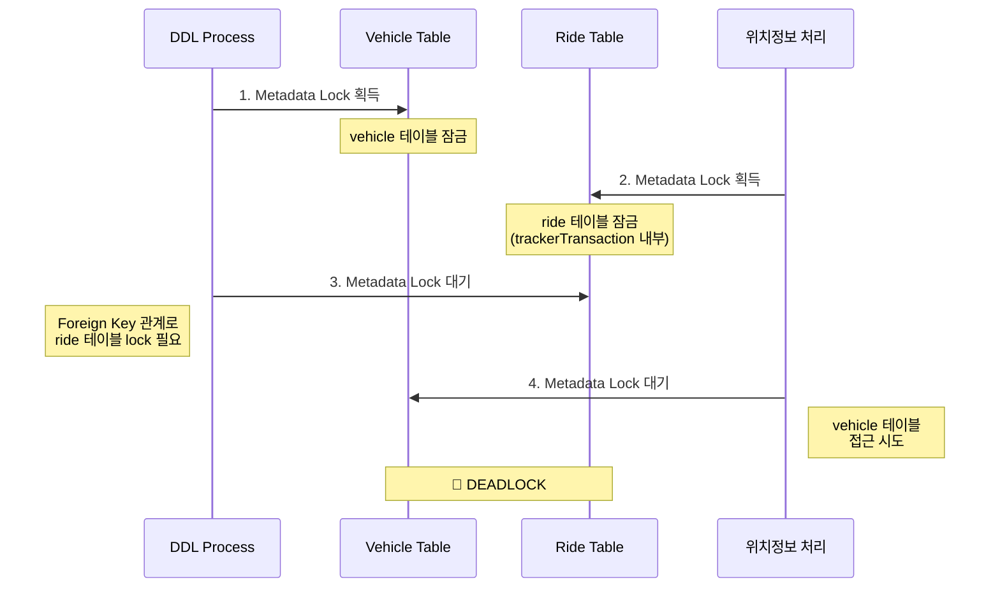
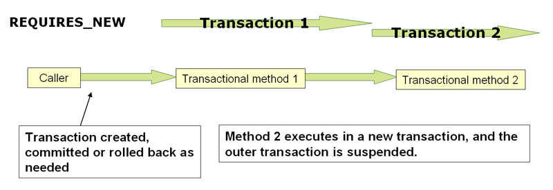

회사에서 프론트 개발을 하다가 서버 개발을 제대로 시작한 지 1년 반 정도 지났습니다.
Spring 관련 인터넷 강의, 공식 문서 외에는 따로 공부하고 있지 않았는데 회사에서 겪은 문제를 기반으로 Spring JPA 내부 코드를 파악했던 경험을 기록해두려고 합니다.

# 최근에 마주한 문제들

## 첫번째 문제, add column to vehicle table DDL

최근에 [타다](https://www.tadatada.com/) 서버를 배포하던 중에 차량(vehicle) 테이블에 컬럼을 추가하는 DDL과 차량 위치 추적 데이터 처리에서 deadlock이 발생했습니다.

타다에서는 차량(vehicle) 테이블을 드라이버(driver), 운행정보(ride) 등 많은 테이블이 foreign key를 이용해서 참조하고 있습니다.
또한 일반 정보를 저장하는 **PrimaryDatabase**와 차량 위치를 추적하는 **TrackerDatabase**를 분리하여 관리하고 있습니다.

```kotlin
class TestController(
  private val transactionTemplate: TransactionTemplate,
  @Qualifier("trackerDB") private val trackerTransactionTemplate: TransactionTemplate,
) {
  private fun transactionInTrackerTransaction() {
    trackerTransactionTemplate
      .also { it.isolationLevel = IsolationLevel.SERIALIZABLE }
      .execute {
        val trackerRide = trackerRepository.findById("...")

        // No explicit transaction
        val acceptedRide = rideRepository.findById("...")

        transactionTemplate
          .execute {
            driverRepository.findById("...")
            vehicleRepository.findById("...")
          }
      }
  }
}
```

타다 차량의 위치를 처리하는 과정은 위 코드와 같이 차량 위치(tracker), 운행정보(ride), 드라이버(driver) 그리고 차량(vehicle) 테이블에 접근합니다.
이 과정은 많은 드라이버의 위치 정보를 처리해야 하므로 빈번하게 호출됩니다.

이러한 상황에서 vehicle에 column을 추가하는 DDL을 실행하면:



실제로 코드를 차례대로 실행하면 trackerTransactionTemplate이 종료될 때까지 `rideRepository.findById`에서 잡은 ride 테이블의 metadata lock이 유지됩니다.

`rideRepository.findById`를 transactionTemplate으로 감싸면 ride에 대한 metadata lock이 빠르게 해제되면서 해당 문제는 해결됩니다.

## 두번째 문제, ReadReplica Transaction in Serializable Transaction

다른 기능을 배포하는 과정에서 `could not execute statement [The MySQL server is running with the --read-only option so it cannot execute this statement]` 에러가 발생했습니다.
타다에서는 읽기 부하 분산을 위해 ReadReplica 데이터베이스를 사용하며, TransactionTemplate에 `isReadReplicaEnabled`라는 커스텀 속성을 추가하여 ReadReplica로 라우팅할 수 있도록 구현했습니다.

```kotlin
@RestController
class TestController(
  private val transactionTemplate: TransactionTemplate,
) {
  @Transactional(isolation = Isolation.SERIALIZABLE)
  private fun readReplicaInSerializable() {
    // 인증 토큰 확인은 아래와 같이 유저 정보에 접근합니다.
    transactionTemplate
      .also { it.isReadReplicaEnabled = true }
      .execute {
        userRepository.findById("...")
      }
    val ride = rideRepository.findById("...")
    // update something
    rideRepository.save(ride)
  }
}
```

대부분 API에 토큰에 대한 검증을 하는 과정이 있습니다. 이때 마스터 데이터베이스를 보기보다는 READ REPLICA 데이터베이스에 접근해서 부하를 분산합니다.

그런데 위와 같이 코드를 작성하면 이후 데이터를 업데이트하는 `rideRepository.save`에서 문제가 발생합니다.
외부 Transaction이 먼저 시작되었으니 마스터 데이터베이스 연결을 사용하고, 내부 transactionTemplate도 이를 재활용할 것으로 기대했지만 실제로는 다르게 동작했습니다.

두 문제에 대해서 정확한 원인을 파악하기 위해서는 TransactionTemplate이 어떻게 동작하는지, TransactionTemplate이 없을 때 Repository로 데이터 접근할 때 어떻게 동작하는지 그리고 데이터베이스에 연결을 어떻게 맺는지 이해할 필요가 있었습니다.

# 먼저 TransactionTemplate 동작 이해하기

`TransactionTemplate.execute`는 크게 3 step으로 나눌 수 있습니다.

```java
public <T> T execute(TransactionCallback<T> action) {
  // Step 1: Transaction에 필요한 Context를 구성하기
  TransactionStatus status = this.transactionManager.getTransaction(this);

  try {
    // Step 2: Context로 데이터에 접근하기
    result = action.doInTransaction(status);
  } catch() { /* rollback */ }

  // Step 3: Commit과 리소스 정리
  this.transactionManager.commit(status);
  return result;
}
```

## Transaction에 필요한 Context를 구성하기

```java
public final TransactionStatus getTransaction(TransactionDefinition definition) {
  Object transaction = doGetTransaction();
  if (isExistingTransaction(transaction)) {
    return handleExistingTransaction(definition, transaction, debugEnabled);
  }
  return startTransaction(definition, transaction, debugEnabled, suspendedResources);
}
```

`AbstractPlatformTransactionManager.getTransaction`에서는 이미 선언한 Transaction이 있는지, 이미 Transaction이 진행 중이라면 Propagation 정책에 따라 새로운 Transaction에 필요한 Context를 만들지 정합니다.

```java
// JpaTransactionManager.doGetTransaction
EntityManagerHolder emHolder = (EntityManagerHolder) TransactionSynchronizationManager.getResource(obtainEntityManagerFactory());
if (emHolder != null) {
  txObject.setEntityManagerHolder(emHolder, false);
}
if (getDataSource() != null) {
  ConnectionHolder conHolder = (ConnectionHolder)TransactionSynchronizationManager.getResource(getDataSource());
  txObject.setConnectionHolder(conHolder);
}
```

여기서 Context(EntityManager, Connection)는 `TransactionSynchronizationManager`를 통해 가져옵니다. `TransactionSynchronizationManager`는 Resource들을 ThreadLocal에 저장합니다.

새로 시작하는 Transaction의 경우 저장된 Context가 없기 때문에 `startTransaction` 함수에서 새로 만듭니다.

```java
// JpaTransactionManager.java
if (!txObject.hasEntityManagerHolder() || txObject.getEntityManagerHolder().isSynchronizedWithTransaction()) {
  EntityManager newEm = createEntityManagerForTransaction();
  txObject.setEntityManagerHolder(new EntityManagerHolder(newEm), true);
}
EntityManager em = txObject.getEntityManagerHolder().getEntityManager();
TransactionSynchronizationManager.bindResource(obtainEntityManagerFactory(), txObject.getEntityManagerHolder());

ConnectionHandle conHandle = getJpaDialect().getJdbcConnection(em, definition.isReadOnly());
ConnectionHolder conHolder = new ConnectionHolder(conHandle);
TransactionSynchronizationManager.bindResource(getDataSource(), conHolder);
txObject.setConnectionHolder(conHolder);
```

EntityManager를 새로 만들고, JdbcConnection을 `TransactionSynchronizationManager`를 통해 ThreadLocal에 저장합니다.

## Context로 데이터에 접근하기

Context를 가져와서 Callback 함수를 처리하는데 보통 Repository로 데이터를 가져오고 씁니다. `Repository.findById` 함수를 호출하면 Proxy 객체를 통해 `TransactionAspectSupport.invokeWithinTransaction`을 호출합니다. 함수명에서 유추할 수 있듯이 시작한 Transaction Context를 불러와서 데이터에 접근합니다.

```java
protected Object invokeWithinTransaction(Method method, @Nullable Class<?> targetClass, final InvocationCallback invocation) throws Throwable {
  TransactionAttribute txAttr = (tas != null ? tas.getTransactionAttribute(method, targetClass) : null);
  TransactionManager tm = determineTransactionManager(txAttr);

  if (txAttr == null || !(ptm instanceof CallbackPreferringPlatformTransactionManager cpptm)) {
    TransactionInfo txInfo = createTransactionIfNecessary(ptm, txAttr, joinpointIdentification);

    try {
      retVal = invocation.proceedWithInvocation();
    } finally {
      cleanupTransactionInfo(txInfo);
    }
    commitTransactionAfterReturning(txInfo);
    return retVal;
  }
}
```

`createTransactionIfNecessary`에서는 `TransactionManager.getTransaction`을 호출하여 TransactionTemplate 동작과 비슷하게 이미 정의한 EntityManager, Connection을 이용해서 데이터에 접근합니다.
데이터 접근 이후에는 `commitTransactionAfterReturning`을 통해 Transaction 상태에 따라 commit을 진행합니다.
Transaction이 없는 경우 `commitTransactionAfterReturning`에서는 commit을 하지 않습니다.

### Transaction 없이 데이터에 접근할 때는?

Transaction 없이 `Repository.findById` 함수를 호출하면 조금 다르게 동작합니다.
`createTransactionIfNecessary` 내부에서 Transaction Context를 가져오지 못합니다.
Query 실행 내부를 따라가다 보면 `SharedEntityManagerCreator` proxy 객체에서 EntityManager를 직접 만드는 것을 찾을 수 있습니다.

```java
public abstract class SharedEntityManagerCreator {
  private static class SharedEntityManagerInvocationHandler implements InvocationHandler, Serializable {
    public Object invoke(Object proxy, Method method, Object[] args) throws Throwable {
      EntityManager target = EntityManagerFactoryUtils.doGetTransactionalEntityManager(this.targetFactory, this.properties, this.synchronizedWithTransaction);
      // ...
      if (target == null) {
        target = this.targetFactory.createEntityManager();
        isNewEm = true;
      }
    }
  }
}

public abstract class EntityManagerFactoryUtils {
  public static EntityManager doGetTransactionalEntityManager(EntityManagerFactory emf, @Nullable Map<?, ?> properties, boolean synchronizedWithTransaction) throws PersistenceException {
    EntityManagerHolder emHolder = (EntityManagerHolder) TransactionSynchronizationManager.getResource(emf);
    if (emHolder != null) {
      return emHolder.getEntityManager();
    }
    if (!TransactionSynchronizationManager.isSynchronizationActive()) {
      return null;
    }
    if (em == null) {
      em = (!CollectionUtils.isEmpty(properties) ? emf.createEntityManager(properties) : emf.createEntityManager());
    }
    TransactionSynchronizationManager.bindResource(emf, emHolder);
  }
}
```

`SharedEntityManagerInvocationHandler`에서 EntityManager가 있는지 먼저 확인합니다.
Transaction이 없는 상황에서는 null을 return하여 `target = this.targetFactory.createEntityManager();`를 통해 새로운 EntityManager를 생성합니다.
그런데 이미 TransactionSynchronizationManager가 관리하고 있는 Context가 있다면 (`TransactionSynchronizationManager.isSynchronizationActive`) 새로 만들고 ThreadLocal에 저장합니다.
이 부분이 처음에 소개한 문제와 관련이 있습니다.

참고) [[JPA] SimpleJpaRepository의 EntityManager는 어디서 생성될까?](https://jaeseo.tistory.com/entry/SimpleJpaRepository%EC%9D%98-EntityManager%EB%8A%94-%EC%96%B4%EB%94%94%EC%84%9C-%EC%83%9D%EC%84%B1%EB%90%A0%EA%B9%8C)

## Commit과 리소스 정리

`TransactionManager.commit`에서는 commit, doAfterCommit, Context 정리하는 과정을 거칩니다.

```java
if (status.isNewSynchronization()) {
  for (TransactionSynchronization synchronization : TransactionSynchronizationManager.getSynchronizations()) {
    TransactionSynchronizationManager.unbindResource(synchronization);
  }
}

if (status.isNewTransaction()) {
  doCommit(status); // Actual database commit
}
triggerAfterCommit(status);
cleanupAfterCompletion(status);
```

이전 섹션에서 언급했듯이, TransactionTemplate을 시작할 때와 Repository 접근에서 commit 함수를 부릅니다. 그때 모든 Transaction에서 데이터베이스 commit을 부르는 것은 아니고 `isNewTransaction`을 통해서 최상위 Transaction에서만 commit을 호출합니다.

```java
private void cleanupAfterCompletion(DefaultTransactionStatus status) {
  if (status.isNewSynchronization()) {
    TransactionSynchronizationManager.clear();
  }
  if (status.isNewTransaction()) {
    JpaTransactionObject txObject = status.getTransaction();
    txObject.getEntityManagerHolder().clear();
    // ...
  }
}
```

Context를 정리하는 과정에서는 `TransactionSynchronizationManager`를 통해서 ThreadLocal에 저장되어 있는 리소스들을 정리합니다.

## 예시

```kotlin
transactionTemplate
  .also { it.isolationLevel = IsolationLevel.SERIALIZABLE }
  .execute { // 1
    val driver = driverRepository.findByIdOrNull("DVC40729") // 2
  }
```

1. TransactionTemplate의 시작으로 `TransactionSynchronizationManager`에 정의된 EntityManager가 없기 때문에 `TransactionManager.startTransaction`을 통해 EntityManager를 만들고 JdbcConnection을 맺습니다. 만든 객체는 `TransactionSynchronizationManager`를 통해 ThreadLocal에 저장합니다.
2. Repository 함수는 Proxy 객체로 만들어져 있어 내부에서 `TransactionAspectSupport.invokeWithinTransaction`을 호출하고 `TransactionSynchronizationManager`를 통해 ThreadLocal에 저장된 EntityManager를 가져와 데이터에 접근합니다.

---

# 최근에 마주한 문제들 해결하기

TransactionTemplate과 Repository 동작을 이해했으니 처음에 언급한 문제들을 차례대로 분석해보겠습니다.

## 첫번째 문제, add column to vehicle table DDL

```kotlin
class TestController(
  private val transactionTemplate: TransactionTemplate,
  @Qualifier("trackerDB") private val trackerTransactionTemplate: TransactionTemplate,
) {
  private fun transactionInTrackerTransaction() {
    trackerTransactionTemplate
      .also { it.isolationLevel = IsolationLevel.SERIALIZABLE }
      .execute { // 1
        val trackerRide = trackerRepository.findById("...") // 2

        val acceptedRide = rideRepository.findById("...") // 3

        transactionTemplate
          .execute { // 4
            driverRepository.findById("...")
            vehicleRepository.findById("...")
          }
      } // 5
  }
}
```

#### 1. TrackerTransaction 시작

`TrackerDatabaseConfiguration`에서 주입한 TransactionManager를 통해 새로운 Transaction을 시작합니다. `TransactionSynchronizationManager`에 정의한 EntityManager가 없으니 새로 만듭니다.

#### 2. val trackerRide = trackerRepository.findById("...")

`TransactionAspectSupport.invokeWithinTransaction` 를 호출하고 1 에서 정의한 EntityManager 를 활용해 데이터를 가져옵니다.

#### 3. val acceptedRide = rideRepository.findById("...")

`TransactionAspectSupport.invokeWithinTransaction` 를 호출하지만, `PrimaryDatabaseConfiguration` 의 EntityManagerFactory 를 사용하므로 1 에서 정의한 EntityManager 를 사용하지 못하고 새로운 EntityManager 를 만듭니다.

[이전에 언급했듯이](#transaction-없이-데이터에-접근할때는), Transaction 없이 Repository 접근은 EntityManager 를 새로 만들어 데이터 접근 후 ThreadLocal 에 저장하지 않고 해제됩니다.
그런데 Tracker Transaction 내부이기 때문에 `TransactionSynchronizationManager` 에 저장된 Synchronization 이 존재합니다. 그래서 PrimaryDatabase 에 대한 Transaction 이 아니더라도 ThreadLocal 에 EntityManager 를 저장합니다.

```java
if (!TransactionSynchronizationManager.isSynchronizationActive()) {
  // TrackerTransactionTemplate 으로 인해 isSynchronizationActive = true
  return null;
}
if (em == null) {
  em = (!CollectionUtils.isEmpty(properties) ? emf.createEntityManager(properties) : emf.createEntityManager());
}
// ThreadLocal 에 TrackerDatabase 에 접근하는 EntityManager, PrimaryDatabase 에 접근하는 EntityManager 2개 존재한다.
TransactionSynchronizationManager.bindResource(emf, emHolder);
```

이후 데이터를 불러오고 나서 commit 하면서 리소스를 해제할 수 있지만 Transaction 이 없기 때문에 `commitTransactionAfterReturning` 에서 commit 도 부르지 않아 관련 Context 들을 정리하지 않습니다.

```java
protected Object invokeWithinTransaction(Method method, @Nullable Class<?> targetClass, final InvocationCallback invocation) throws Throwable {
  // ...
  try {
    retVal = invocation.proceedWithInvocation();
  } finally {
    cleanupTransactionInfo(txInfo);
  }
  // txInfo = null 이기 때문에 내부에서 txInfo.getTransactionManager().commit 을 호출하지 않는다.
  commitTransactionAfterReturning(txInfo);
}
```

#### 4. 내부 transactionTemplate.execute

새로운 PrimaryDatabase 의 Transaction 이 시작합니다.
3번과 같은 PrimaryDatabase 접근이기 때문에 같은 EntityManager 를 재활용 한다고 생각할 수 있지만 재활용하지 않고 새로 만듭니다.

여기서는 이전에 언급하지 않은 `suspend` / `resume` 에 대해서 알아야합니다.
새로운 Transaction 을 만들 때 같은 EntityManager 를 접근하게 되면 의도치 않은 객체 변경 / flush 를 유발할 수 있습니다.
이미 진행중인 EntityManager 는 suspend 함수를 통해 `TransactionSynchronizationManager` 에서 제거 후 해당 TransactionObject 에 잠시 저장합니다.
그리고 새롭게 진행되는 Transaction 의 EntityManager 를 ThreadLocal 에 저장합니다.


<small>출처: [What does suspending a transaction mean?](https://stackoverflow.com/questions/33729810/what-does-suspending-a-transaction-mean)</small>

위 그림과 같이 Transaction 1 이 실행중일 때 PROPAGATION_REQUIRES_NEW로 Transaction 2 가 시작되면, ThreadLocal에 저장되어 있던 Transaction 1의 정보를 TransactionObject에 잠시 저장(suspend)합니다. Transaction 2가 완료되면 다시 Transaction 1의 정보를 ThreadLocal로 복구(resume)합니다.

```java
public final TransactionStatus getTransaction(TransactionDefinition definition) {
  Object transaction = doGetTransaction();
  if (isExistingTransaction(transaction)) {
    return handleExistingTransaction(definition, transaction, debugEnabled);
  }
  // 이전 Transaction 의 context 를 새로 시작하는 TransactionObject 에 suspendedResources 로 저장한다.
  SuspendedResourcesHolder suspendedResources = suspend(null);
  return startTransaction(definition, transaction, debugEnabled, suspendedResources);
}

private TransactionStatus handleExistingTransaction(TransactionDefinition definition, Object transaction, boolean debugEnabled) throws TransactionException {
  // ...
  if (definition.getPropagationBehavior() == TransactionDefinition.PROPAGATION_REQUIRES_NEW) {
    // 이전 Transaction 의 context 를 새로 시작하는 TransactionObject 에 suspendedResources 로 저장한다.
    SuspendedResourcesHolder suspendedResources = suspend(transaction);
    try {
      return startTransaction(definition, transaction, debugEnabled, suspendedResources);
    }
  }
}
```

새로운 Transaction 이 끝날 때 commit 을 호출하고 리소스를 정리하는 과정에서 resume 함수를 호출하고 이전 suspend 했었던 Context 를 복구합니다. 여기서 3번에서 만든 EntityManager 를 다시 ThreadLocal 에 저장합니다.

```java
private void cleanupAfterCompletion(DefaultTransactionStatus status) {
  // ...
  if (status.getSuspendedResources() != null) {
    // 이전 Transaction 으로 인해 suspendedResources 가 있다면 다시 ThreadLocal 에 저장한다.
    resume(transaction, (SuspendedResourcesHolder) status.getSuspendedResources());
  }
}
```

#### 5. TrackerTransaction 종료

trackerTransactionTemplate 를 commit 하면서 기존 `TransactionSynchronizationManager` 에 있던 resource 들을 모두 정리합니다. 이때 3번에서 정의한 Context 까지 같이 정리하면서 ride 테이블의 metadata lock 이 해제됩니다.

## 두번째 문제, ReadReplica Transaction in Serializable Transaction

```kotlin
@RestController
class TestController(
  private val transactionTemplate: TransactionTemplate,
) {
  @Transactional(isolation = Isolation.SERIALIZABLE)
  private fun readReplicaInSerializable() {
    // 인증 토큰 확인은 아래와 같이 유저 정보에 접근합니다.
    transactionTemplate
      .also { it.isReadReplicaEnabled = true }
      .execute { // 1
        userRepository.findById("...") // 2
      }
    val ride = rideRepository.findById("...")
    // update something
    rideRepository.save(ride) // 3
  }
}
```

#### 1. @Transactional로 외부 Transaction 시작

`@Transactional` 어노테이션이 AOP를 통해 메서드 실행 전에 Transaction Context 를 새로 만듭니다.
`JpaTransactionManager` 에서 JdbcConnection 을 접근하면서 database 와 실제 database connection 을 맺습니다.

```java
ConnectionHandle conHandle = getJpaDialect().getJdbcConnection(em, definition.isReadOnly());
if (conHandle != null) {
  ConnectionHolder conHolder = new ConnectionHolder(conHandle);
  TransactionSynchronizationManager.bindResource(getDataSource(), conHolder);
  txObject.setConnectionHolder(conHolder);
}
```

근데 여기서 주의할 점은, 현재 타다 프로젝트에서는 `LazyConnectionDataSourceProxy` 를 사용하고 있습니다. `LazyConnectionDataSourceProxy` 는 Connection 객체를 만들때 실제로 database 에 연결하지 않고 proxy 객체만 만듭니다. 그리고 데이터에 접근할 때 connection 을 맺습니다.

```kotlin
class PrimaryDatabaseConfiguration() {
  @Bean
  fun mainDataSource(): DataSource {
    return ReadReplicaAwareDataSourceFactory(dataSource = /* master db */, replicaDataSource = /* replica db */).createInstance()
  }
}

// LazyConnectionDataSourceProxy 을 사용
class ReadReplicaAwareDataSourceFactory(private val dataSource: DataSource, private val replicaDataSource: DataSource,) : DataSourceFactory {
  override fun createInstance(): DataSource {
    val readOnlyRoutingDataSource = ReadOnlyRoutingDataSource()
    readOnlyRoutingDataSource.setTargetDataSources(replicaMap) // replicaMap is ["slave": replicaDataSource]
    readOnlyRoutingDataSource.setDefaultTargetDataSource(dataSource)
    return LazyConnectionDataSourceProxy(readOnlyRoutingDataSource)
  }
}
```

`LazyConnectionDataSourceProxy` 는 connection 을 한번 만든 다음 캐싱해놓습니다.
```java
// LazyConnectionDataSourceProxy.java
private Connection getTargetConnection(Method operation) throws SQLException {
  if (this.target == null) {
    // ...
    this.target = (this.username != null) ? obtainTargetDataSource().getConnection(this.username, this.password) : obtainTargetDataSource().getConnection();
    // ...
  }
}
```

#### 2. 내부 transactionTemplate으로 새로운 트랜잭션 시작

내부 transactionTemplate으로 새로운 트랜잭션을 시작하며 처음 데이터에 접근합니다. 이때 isReadReplicaEnabled 옵션이 true로 설정되어 있으니 `determineCurrentLookupKey` 함수를 통해 ReadReplica database 로 연결을 맺습니다.

```kotlin
class ReadOnlyRoutingDataSource : AbstractRoutingDataSource() {
  // defaultTargetDataSource is "master" database.
  private var dataSourceKeys: List<Any>? = null // "slave"

  // 실제 데이터 접근할 때 불리는데, isReadReplicaEnabled = true 이므로 REPLICA 클러스터에 접근한다.
  override fun determineCurrentLookupKey(): Any? {
    return if (isReadReplicaEnabled && dataSourceKeys!!.isNotEmpty()) {
      val randomDataSourceKey = dataSourceKeys!![getRandom(this.dataSourceKeys!!.size)]
      return randomDataSourceKey
    } else null
  }
}
```

#### 3. ReadReplica 데이터베이스에서 에러 발생

이후 ReadReplica 데이터베이스에 update 명령어를 요청하니, read only 옵션에서 수행할 수 없다고 에러가 발생합니다.

---

# 정리

이번 문제들을 통해 Spring의 Transaction 관리가 단순히 `@Transactional` 어노테이션이나 `TransactionTemplate`을 사용하는 것 이상의 복잡한 메커니즘으로 동작한다는 것을 깊이 이해하게 되었습니다.
Transaction 컨텍스트가 ThreadLocal에 저장되고 `TransactionSynchronizationManager`를 통해 관리된다는 점, 그리고 여러 데이터베이스를 사용할 때는 각 EntityManagerFactory별로 독립적으로 관리된다는 것을 알게 되었습니다.
또한 `LazyConnectionDataSourceProxy`를 사용할 때는 Connection이 한 번 생성되면 캐싱되므로, Transaction 초기가 아닌 첫 데이터 접근 시점의 설정이 전체 Transaction에 영향을 미친다는 것도 알게 됐습니다.
여러 데이터베이스를 사용하거나 ReadReplica를 활용하는 복잡한 환경에서 관련된 이해가 많은 도움이 되었습니다.
